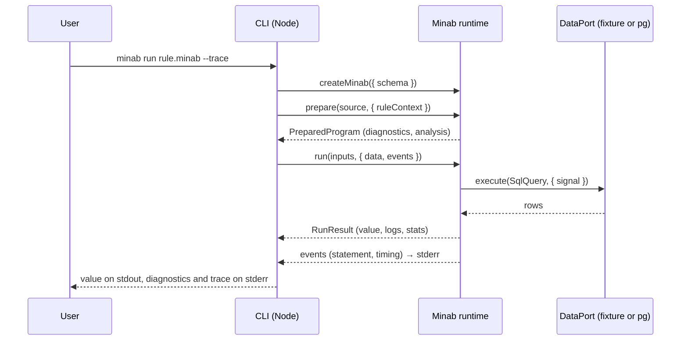
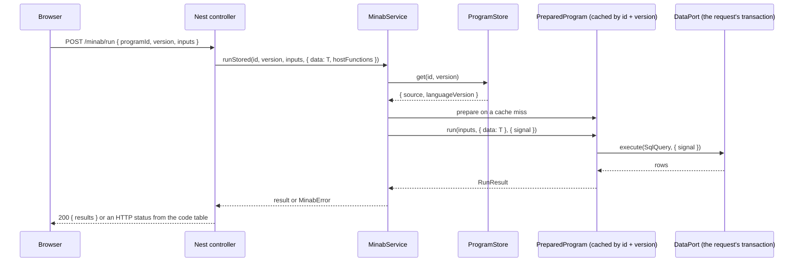
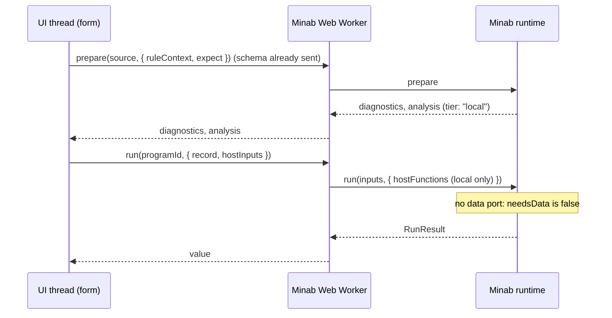
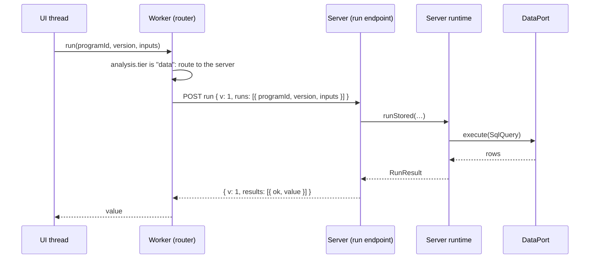
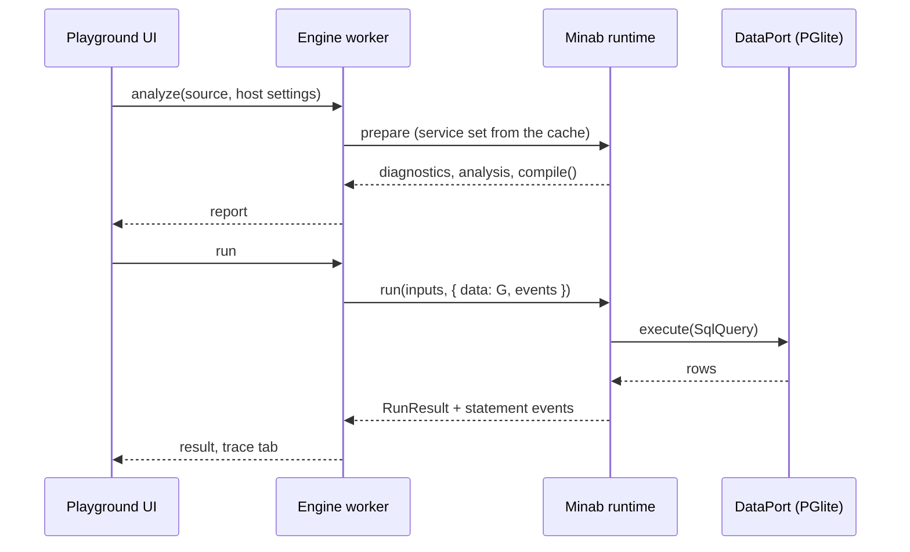

# ADR 0002: One runtime, its ports, and where programs run

**Status:** Proposed. It waits for the owner's approval (phase R1). The owner moves it to Accepted.

**Date:** 2026-10-02

**Decisions it records:** D01, D27 to D38 (see [Decision summary](#2-decision-summary)). The owner answered all of them in the A2 sitting, and D28 in this phase.

**Builds on:** [ADR 0001](0001-execution-strategy.md) (compile to SQL where it fits, interpret the rest).

This ADR changes no code. R2 to R8, H1 to H7 and E1 to E5 build what it describes.

## 1. Context

### Two hosts, hand-written

Today two programs run Minab, and each wires it by hand over raw Langium services.

| Host | Where | What it does |
|---|---|---|
| CLI | `src/cli/main.ts` | `createMinabServices(NodeFileSystem, …)` → build a document → validate → `compile` or `interpreter.evaluate` |
| Playground | `playground/src/engine/{engine,language}.ts` | The same, in a Web Worker, with PGlite. One fixed document URI per "channel" |

A NestJS app would be a third copy. Nothing is wrong with the core. It has no I/O: only the language-server entry (`main.ts`) imports Node things. There is one driven port, `QueryExecutor` (`src/language/minab-executor.ts`). What is missing is the **driving side**: one API that hosts call.

Other gaps in what exists:

- `SchemaProvider` is bound into the services at construction, so one service set exists per schema and rule context.
- `MinabFunctionSchema` exists in `schema.ts` and nothing uses it.
- `EvalResult` has only a text `reason`. A host cannot map it to an HTTP status or an editor marker.
- `onStatement` is the only observation hook. There is no clock, no cancellation and no limit.

### What Shamsine needs

Shamsine (`shams-app/monorepo`) is the main host. I read its Minab cards, M.0 to M.16, and these files (read only):

- `packages/core/service/src/common/condition/condition.schema.ts`
- `packages/core/service/src/view/surface/surface.schema.ts`
- `packages/core/service/prisma/schema.prisma`

What they say, in short:

1. **Who writes programs (D01).** App builders write Minab in the browser: in the form and page designer (`Bindable<T> = { value?, bound?: { expect, expression } }`), in filter conditions (the `minab` operand: `{ expect, expression }`) and later in commands. Shamsine stores the source in MongoDB next to the view or field. Every program is untrusted input.
2. **Two tiers (M.0).** `local` expressions read the current record, the current user, `now` and URL values. They run in the browser. `data` expressions read other records. They run in `core/service` (NestJS) against Dynodb (Postgres, one database per application), in batches. The analyzer picks the tier.
3. **The calls the cards expect:** `check(source, schema, expect)` → diagnostics with ranges and codes (M.1); `analyze` → fields, context variables, functions, `tier` (M.2); `evaluate(ast, context, dataSource)` with limits, an injected clock and typed errors (M.3); a save-time check with `{ element id, property path, range }` errors (M.6); a batch endpoint (M.8); a local `useBindable` that re-runs only the expressions whose fields changed (M.9); a debounced, cached remote call (M.10); Monaco with live `check()` (M.12, M.13).
4. **A difference to settle.** M.3 and M.7 say `DataSource` (record by id, query, aggregate). Minab's port carries SQL (D28). Shamsine implements `DataPort` on Dynodb through its own SQL path. M.8 posts expression text. D34 says the server runs stored programs by id. The mapping is in [section 13](#13-shamsine).
5. **Another small difference.** `MinabExpressionSchema.expect` in the surface schema is any non-empty string. The condition schema limits it to six values (`text`, `number`, `boolean`, `date`, `dateTime`, `list`). The monorepo should use the six everywhere (a note for G2).

## 2. Decision summary

| ID | Answer | In this ADR |
|---|---|---|
| D01 | (a) Programs are written by end users. Every program is untrusted. Limits are always on. The server never accepts SQL or a schema from a browser. The schema given to a program is its whole read surface. | [12](#12-security-model) |
| D27 | (a) Typed, read-only **host inputs** read by bare name. Typed **host functions** run in the interpreter only, never in SQL, marked `local` when safe in the browser. Names follow D10 and D11. | [4.3](#43-host-functions-and-host-inputs) |
| D28 | **(a) SQL text plus parameters.** A browser never sends SQL. When it needs server data it sends the program id and inputs (D34). A structured data request is only the upgrade path. *Answered by the owner in this phase, 2026-10-02.* | [4.1](#41-dataport), [14](#14-alternatives-considered) |
| D29 | (a) Whole schema up front, with a `version`. The runtime caches language services per version. Checking stays synchronous. | [3](#3-the-driving-api), [10](#10-concurrency) |
| D30 | (a) The browser prepares and checks in a Web Worker and runs tier `local` programs there. Tier `data` runs on the server by program id. No offline data runs for 1.0. | [8](#8-topologies) |
| D31 | (a) One package, entry points, optional peers. | [11](#11-packaging) |
| D32 | (a) ES modules plus a CommonJS bundle for `.`, `/node`, `/nestjs`, Langium bundled in. | [11](#11-packaging) |
| D33 | (a) One stream of typed events (`statement`, `log`, `timing`). | [4.5](#45-eventsink) |
| D34 | (a) Hosts store `{ source, languageVersion }`. The run endpoint runs stored programs by id and version through a `ProgramStore`. It never runs browser source text, except in a development mode that is off by default. | [4.6](#46-programstore), [9](#9-wire-format-v1) |
| D35 | (a) English messages, stable codes and parameters. Hosts translate. | [5](#5-results-and-errors) |
| D36 | (a) The default limits table. | [6](#6-limits-and-cancellation) |
| D37 | (a) Logs are for debugging. Off by default in production on a server. Capped. One line per entry. | [4.5](#45-eventsink), [12](#12-security-model) |
| D38 | Break freely before 1.0 (the owner's answer differs from the recommendation). From 1.0, option (a): no breaking change in 1.x, deprecations warn first. | [5](#5-results-and-errors), [9](#9-wire-format-v1), [15](#15-consequences) |

Also used: D09 (approved dependencies), D10 and D11 (names), D17 (exact decimals), D21 (dates, time zones, `NOW()`).

## 3. The driving API

Hosts call these. Inputs are **given**. Ports are **asked** (see the next section).

```ts
// ---- entry --------------------------------------------------------------

export function createMinab(options: MinabOptions): Minab;

export interface MinabOptions {
    /** The whole read surface of every program (D01, D29). */
    schema: MinabSchema;                          // now carries `version: string`
    /** Declared by the host. Implementations come with each run (see HostFunctions). */
    hostFunctions?: HostFunctionDeclaration[];
    hostInputs?: HostInputDeclaration[];
    /** Overrides for the D36 defaults. */
    limits?: Partial<Limits>;
    /** How many service sets to keep, least recently used out. Default 8. */
    serviceCacheSize?: number;
    /** `development` re-validates the grammar on every parser build: grammar work only. Default `production`. */
    mode?: 'development' | 'production';
}

export interface Minab {
    /** Parse and check. Synchronous result shape, asynchronous because Langium builds documents with promises. */
    prepare(source: string, options?: PrepareOptions): Promise<PreparedProgram>;
    /** Release caches. A disposed runtime throws on use. */
    dispose(): void;
}

export interface PrepareOptions {
    /** Where the program sits: which table `.` means, whether `$` exists and its type (spec §6). */
    ruleContext?: MinabRuleContext;
    /** The type the host wants back (Shamsine: text, number, boolean, date, dateTime, list). */
    expect?: ExpectedType;
    /** The language version the program was written for (Q5). Default: the current one. */
    languageVersion?: string;
}

// ---- the prepared program ----------------------------------------------

export interface PreparedProgram {
    /** Syntax and type errors, warnings, and `expect` mismatches. Empty when the program is valid. */
    readonly diagnostics: readonly MinabDiagnostic[];
    /** `false` when any diagnostic has severity `error`. `run` and `compile` then refuse. */
    readonly ok: boolean;
    readonly kind: 'query' | 'record-rule' | 'field-rule' | 'value' | 'empty';
    /** The type of the final expression (`BOOLEAN`, `DECIMAL`, …), when it has one. */
    readonly resultType?: string;
    readonly analysis: ProgramAnalysis;           // section 7
    readonly languageVersion: string;
    /** The whole program as one SQL statement, or why it is not one (as `CompiledSql` in the playground today). */
    compile(): CompileResult;
    run(inputs: RunInputs, ports: RunPorts, options?: RunOptions): Promise<RunResult>;
}

/** Given, never asked: the record under validation, `$`, and the values of the declared host inputs. */
export interface RunInputs {
    record?: Record<string, unknown>;
    fieldValue?: unknown;
    hostInputs?: Record<string, unknown>;
}

export interface RunPorts {
    data?: DataPort;                              // missing: any statement fails with `data.noPort`
    write?: WritePort;                            // X5
    hostFunctions?: HostFunctions;
    clock?: ClockPort;                            // default: system clock, UTC
    events?: EventSink;
}

export interface RunOptions {
    signal?: AbortSignal;
    limits?: Partial<Limits>;                     // may only be tighter than the host's, or equal
}

export type ExpectedType =
    | 'text' | 'number' | 'boolean' | 'date' | 'dateTime' | 'list'   // Shamsine's six
    | { minab: string };                          // a Minab type name, e.g. "INTEGER[]"
```

Rules:

1. **`prepare` once, `run` many.** A stored rule is parsed and checked once, then run per record. A `PreparedProgram` is immutable and safe to run concurrently (see [10](#10-concurrency)).
2. **`prepare` never throws for a bad program.** It returns diagnostics. It rejects only for a bad *call* (a disposed runtime, a non-string source).
3. **`run` never throws for a failed program.** It returns `{ ok: false, error }` (see [5](#5-results-and-errors)). It rejects only for a bug.
4. **The schema is fixed per `Minab` instance** (D29). A new schema version means a new `createMinab` call, or `minab.withSchema(schema)` (R2 decides the name). The runtime keeps one service set per `schema.version` plus rule context, so the old one stays usable while a run is still using it.
5. **`languageVersion`** is read and stored. Until Q5 builds the policy there is one value.
6. **Rule context per prepare** keeps one `Minab` instance useful for many rules of one schema. A service set is cached per `(schema.version, ruleContext)`.

## 4. Driven ports

All ports are plain TypeScript interfaces. None of them names a Node, DOM or driver type. Every call that can wait receives an `AbortSignal` (D36).

### 4.1 `DataPort`

D28 (a): SQL text plus parameters, as `QueryExecutor` does today.

```ts
export interface DataPort {
    execute(query: SqlQuery, context: { signal: AbortSignal }): Promise<Row[]>;
}
export interface SqlQuery { text: string; params: unknown[] }   // `$1`-style placeholders, as today
export type Row = Record<string, unknown>;
```

- The runtime enforces "statements per run" and "rows per statement" **around** the port. An adapter does not have to.
- A port may return more rows than the limit. The runtime stops at the limit and fails the run with `limit.rows`. An adapter that can add `LIMIT` itself should, to save the database work.
- Values go to the port as JavaScript values (D17: a `DECIMAL` is a `big.js` value in the interpreter). The port turns it into whatever its driver wants. H1's adapters document this. A `DECIMAL` result comes back as a string or number, and the runtime reads both.
- **A browser never sends this SQL to a server** (D28). The browser sends a program id and inputs. See [8](#8-topologies).

### 4.2 `WritePort`

The interface is fixed now. X5 builds it. R3 only declares the type and refuses writes with `compile.writesNotSupported` until X5.

```ts
export interface WritePort {
    /** Run `work` inside one transaction. Commit when it resolves, roll back when it throws or the signal aborts. */
    transaction<T>(work: (tx: WriteTransaction) => Promise<T>, context: { signal: AbortSignal }): Promise<T>;
}
export interface WriteTransaction extends DataPort {
    /** `INSERT`, `UPDATE` or `DELETE` text with parameters. Returns the rows from `RETURNING`, if any. */
    executeWrite(query: SqlQuery, context: { signal: AbortSignal }): Promise<{ rows: Row[]; affected: number }>;
}
```

A request that already has a transaction (NestJS) passes a `WritePort` whose `transaction` joins it. Minab never opens a connection (D01, ADR 0001).

### 4.3 Host functions and host inputs

D27 (a).

```ts
/** Declared once, at `createMinab`. The checker uses it. Names follow D10 (contain a lowercase letter) and D11. */
export interface HostFunctionDeclaration {
    name: string;                 // "fxRate"
    params: { name: string; type: string }[];     // Minab type names: "TEXT", "DECIMAL[]", …
    returns: string;              // "DECIMAL"
    /** `true`: safe in the browser, a program using it can stay tier `local`. Default `false`: it needs the server. */
    local?: boolean;
}
export interface HostInputDeclaration {
    name: string;                 // "currentUser"
    /** A scalar, an array, or a record of typed fields. No relations. */
    type: string | { fields: Record<string, string> };      // { id: "TEXT", email: "CITEXT", roles: "TEXT[]" }
}

/** Implemented by the host, given per run. */
export interface HostFunctions {
    call(name: string, args: unknown[], context: { signal: AbortSignal }): unknown | Promise<unknown>;
}
```

- A host function runs in the **interpreter only**. The SQL compiler refuses any node that contains a call to one, so it is never pushed into SQL. (ADR 0001: "the compiler refuses, the interpreter takes it.")
- A host input is read by bare name (`currentUser.id`). Its value is in `RunInputs.hostInputs`. A missing declared input fails the run with `eval.missingInput`.
- Names: a host function needs a lowercase letter (D10). A `let`, a parameter or an `fn` may not use the name of a host input or host function (D11). Both give diagnostics with codes.
- Host inputs are read-only. A host function must not change state the program can see (the host's duty, written in the guide).

Because `HostFunctions.call` is a single method, the host can implement it with a `switch` or a map. The declarations tell the checker the types. The runtime validates argument count and null rules before the call, and the result type after it (`eval.hostFunctionResult`).

### 4.4 `ClockPort`

```ts
export interface ClockPort {
    /** The instant the run started. The runtime calls it once per run. Every `NOW()` in the run returns it (D21). */
    now(): Date;
    /** IANA name such as "Asia/Tehran". Default "UTC". Used by `TODAY()`, `YEAR()`, `DATE_ADD` with day units, … */
    readonly timeZone: string;
}
```

Tests pass a fixed clock. SQL receives `NOW()` as a bound parameter, not the database's `now()`, so both runtimes agree (D21).

### 4.5 `EventSink`

D33 (a): one stream.

```ts
export type MinabEvent =
    | { kind: 'statement'; query: SqlQuery; range?: SourceRange; rowCount: number; durationMs: number }
    | { kind: 'log';       message: string; range?: SourceRange }
    | { kind: 'timing';    phase: 'prepare' | 'compile' | 'run'; durationMs: number };

export interface EventSink {
    emit(event: MinabEvent): void;       // synchronous, must not throw; the runtime catches and drops a throw
}
```

- `statement` replaces `onStatement`. The `range` is the source span of the Minab node that was compiled (the whole query, or the smallest sub-expression pushed down).
- `log` is `LOG(...)` output (L7). A message is **one line**: the runtime escapes newlines, so a logged value cannot forge a log line (D37).
- The result always carries the collected `logs` and `stats` as well (next section), so a caller with no sink still gets them.
- One adapter per host: stderr (CLI), the playground's tabs, Nest's `Logger`, the wire format.
- Server logging is **off by default when `NODE_ENV=production`** (a H2 default, D37). When on, entries are capped, tagged with the program id and request id, and the docs warn that logged values can hold personal data.

### 4.6 `ProgramStore`

D34 (a). Hosts store each program as `{ source, languageVersion }`. The runtime, with a `ProgramStore`, runs programs by id and version.

```ts
export interface StoredProgram {
    id: string;                          // host's id, e.g. `${viewId}:${nodeId}:${propertyPath}`
    version: string;                     // host's version, e.g. the view revision
    source: string;
    languageVersion: string;
    ruleContext?: MinabRuleContext;
    expect?: ExpectedType;
    schemaVersion?: string;              // when the host pins one; otherwise the runtime's current schema
}
export interface ProgramStore {
    get(id: string, version: string, context: { signal: AbortSignal }): Promise<StoredProgram | undefined>;
}
```

Used by the server host (H2): `minabService.runStored(id, version, inputs, ports)`. It finds the program, prepares it (cached by `id`, `version`, `schemaVersion`) and runs it. A missing program gives `request.programNotFound`. The server never runs source text sent by a browser, except in a **development mode, off by default**, switched on by an explicit option, never by an environment guess.

### 4.7 The schema

`MinabSchema` (today `{ tables, functions }`) gets a `version`. D29.

```ts
export interface MinabSchema {
    /** Shamsine: a hash of the datasets' fields. Two schemas with the same version must be the same. */
    version: string;
    tables: MinabTableSchema[];
    /** Declared host functions move to `MinabOptions.hostFunctions`; this field is removed (nothing used it). */
}
```

The host gives the whole schema before `prepare`. Checking stays synchronous inside Langium (an editor checks on every key press). The host's loader may be asynchronous, but it finishes before `createMinab`.

## 5. Results and errors

```ts
export type RunResult =
    | { ok: true;  value: MinabValue; logs: string[]; droppedLogs: number; stats: RunStats }
    | { ok: false; error: MinabError; logs: string[]; droppedLogs: number; stats: RunStats };

export interface RunStats {
    statements: number;
    rows: number;               // total rows read
    loopIterations: number;
    maxCallDepth: number;
    durationMs: number;
}

export interface MinabError {
    code: string;               // stable, e.g. "limit.statements" (D35)
    message: string;            // English, for people reading logs
    range?: SourceRange;        // where in the source, when known
    params: Record<string, unknown>;   // e.g. { limit: 100, used: 101 }; JSON-safe values only
}

export interface MinabDiagnostic {
    severity: 'error' | 'warning' | 'info' | 'hint';
    code: string;               // "type.implicitCoercion"
    message: string;
    range: SourceRange;
    params: Record<string, unknown>;     // { expected: "INTEGER", actual: "TEXT" }
}

export interface SourceRange { start: { line: number; character: number }; end: { line: number; character: number } }   // 0-based, LSP style
```

### Codes

B1 builds the registry. This ADR fixes the **areas** and what each means. Codes are English-readable, camelCase after the dot, and sorted in the registry (D35). Before 1.0 a code may change (D38). From 1.0 a released code never changes.

| Area | Meaning | Examples (names are a plan, B1 and R4 own the registry) |
|---|---|---|
| `syntax.*` | The text does not parse | `syntax.unexpectedToken` |
| `type.*`, `scope.*`, `rule.*` | The checker (types, names, `$`/`KEY` placement) | `type.implicitCoercion`, `scope.unknownTable` |
| `deprecated.*` | A form that still works and will go (D38, from 1.0) | `deprecated.xyz` |
| `compile.*` | The program cannot become SQL, or a construct is not supported | `compile.hostFunction`, `compile.writesNotSupported` |
| `eval.*` | A run failed inside the interpreter | `eval.divisionByZero`, `eval.integerOutOfRange`, `eval.missingInput`, `eval.hostFunctionResult` |
| `limit.*` | A limit tripped (D36) | `limit.sourceLength`, `limit.depth`, `limit.time`, `limit.statements`, `limit.rows`, `limit.loop`, `limit.callDepth`, `limit.batch` |
| `data.*` | The data port failed or is missing | `data.noPort`, `data.failed` (wraps the driver error, the driver text goes in `params.cause`, off by default in production, see [12](#12-security-model)) |
| `request.*` | The wire request is bad | `request.badVersion`, `request.programNotFound`, `request.badInputs` |
| `cancelled` | The `AbortSignal` fired | `cancelled` (no area dot) |

- A **diagnostic** (prepare time) and an **error** (run time) share the same code space and shape. Hosts map by code, not by text.
- **Translations** (D35): Minab ships English. Hosts translate by `code` and `params`. Shamsine keeps fa, ar and tr in its own translation file.
- **Log entries over the cap** are dropped and counted in `droppedLogs`. They are not an error (D36).

### Mapping to HTTP

For hosts that expose runs over HTTP (H2 does):

| Result | HTTP status |
|---|---|
| `ok: true` | 200 |
| Diagnostics with an error at `prepare` (the stored program is invalid) | 422 |
| `request.*` (bad shape, bad version, bad inputs) | 400 |
| `request.programNotFound` | 404 |
| `limit.*` | 422 for `limit.sourceLength`, `limit.depth` (a property of the program); 429 for `limit.batch`; 408 for `limit.time`; 422 for the other run limits |
| `cancelled` | 499 (the client left; a host may choose to send nothing) |
| `data.*` | 502 (the data source failed) |
| `eval.*`, `compile.*` | 200 with `ok: false` **per run** inside a batch (a failed program is a normal answer), 422 when the request is a single run |
| Anything else (a bug) | 500, without internals |

A batch is always 200 when the request itself is valid. Each run inside it carries its own `ok` and `error`. See [9](#9-wire-format-v1).

## 6. Limits and cancellation

D36 (a): these defaults. A host can lower or raise each one at `createMinab`. A single run can only be **tighter** than the host.

```ts
export interface Limits {
    sourceLength: number;      // 65_536 bytes, UTF-8
    nestingDepth: number;      // 200
    wallTimeMs: number;        // 1_000
    statements: number;        // 100 per run
    rowsPerStatement: number;  // 10_000
    loopIterations: number;    // 100_000 per run
    callDepth: number;         // 64
    logEntries: number;        // 100 per run
    batchRuns: number;         // 100 per wire request
}
```

| Limit | Default | Where it is checked | On trip |
|---|---|---|---|
| `sourceLength` | 64 KB | `prepare`, before parsing | diagnostic `limit.sourceLength` |
| `nestingDepth` | 200 | `prepare`, after parsing, by an AST walk (before the checker, so a deep tree cannot overflow it) | diagnostic `limit.depth` |
| `wallTimeMs` | 1,000 | `run`: a timer aborts an internal `AbortController`, which is joined with the caller's signal. Checked between interpreter steps and passed to every port call | error `limit.time` |
| `statements` | 100 | `run`, just before each data-port call | error `limit.statements` |
| `rowsPerStatement` | 10,000 | `run`, right after each data-port call returns | error `limit.rows` |
| `loopIterations` | 100,000 | `run`, at every loop step, counted across all loops in the run | error `limit.loop` |
| `callDepth` | 64 | `run`, at every `fn` call | error `limit.callDepth` |
| `logEntries` | 100 | `run`, when an entry is emitted | extra entries are dropped and counted, not an error |
| `batchRuns` | 100 | The run endpoint (H2) and the browser client (H5) | request error `limit.batch` |

**Cancellation.**

- Every port call receives an `AbortSignal`. It is the **combination** of the caller's signal and the wall-time timer.
- The interpreter checks it **between steps**: before each node of a loop body, each statement, each call. A single huge SQL statement cannot be interrupted by Minab alone. The data port adapter passes the signal to its driver (H1: `pg` query cancel).
- An aborted run returns `{ ok: false, error: { code: 'cancelled' } }`, or `limit.time` when the timer fired.
- A signal already aborted before `run` returns `cancelled` without calling any port.

**Limits are always on** (D01). There is no "unlimited" setting. A host can set a large number.

## 7. Analysis

`PreparedProgram.analysis` is computed at prepare time from the AST and the schema. R5 builds it.

```ts
export interface ProgramAnalysis {
    /** Tables the program reads (by schema name), through `#Table`, relations, or pushdown. */
    tables: string[];
    /** Fields of the record under validation that the result can depend on (`.field`, `.rel.field`). For re-running a rule only when one of them changes. */
    recordFields: string[];
    readsFieldValue: boolean;          // uses `$`
    hostInputs: string[];              // which declared inputs it reads (and for records, `currentUser.roles`: the path)
    hostFunctions: string[];           // which host functions it calls
    /** The program can reach the data port at all. `false`: a run never calls it. */
    needsData: boolean;
    /** The program contains INSERT, UPDATE or DELETE (X5). */
    writes: boolean;
    /** `local`: safe to run in the browser, no data and only `local` host functions. `data`: needs the server. */
    tier: 'local' | 'data';
}
```

**The rule: analysis is conservative.** When the analyzer cannot prove a program needs no data, it says `needsData: true` and `tier: 'data'`. A wrong `data` costs a network call. A wrong `local` would give a wrong answer or leak. Tests pin this (R5).

- `tier` is `local` only when `needsData` is `false`, `writes` is `false`, and every host function used is declared `local`.
- A program that touches a relation column (`.customer.country`) reads a table, so it is `data`, even though a record "in hand" has the scalar columns.
- The analysis ignores what a program *could* do in a branch not taken. A rule with `if x { #Customer[...] }` is `data`.
- Unknown (a construct R5 does not analyze yet) → `data`.

## 8. Topologies

Five. In all of them the same `PreparedProgram` API runs. Only the ports and where the code runs change.

### 8.1 CLI

`minab run file.minab` (R7). One process. The data port is the fixture executor, or `pg` with `--database`.



### 8.2 NestJS server: a stored program in a request transaction



The server uses **its own** schema, its own data port and its own host functions. It never takes a schema or SQL from the client (D01, D34).

### 8.3 Browser, local (a Web Worker, tier `local`)



No network. The UI thread never loads Langium. Re-runs are triggered by `analysis.recordFields`.

### 8.4 Browser, delegated (program id and inputs to the server)

D28 and D34: **the browser does not send SQL or source.**



H5 batches runs per surface (about 150 ms debounce, M.10) and caches by input values. The worker knows a program's tier from `analysis`, which it computed on prepare, so it routes without asking the server.

### 8.5 Playground (PGlite inside the worker)



PGlite stays for the playground and demos. It is **not** a path for offline data runs in the product (D30). The playground engine is the only host that runs data programs in a browser.

## 9. Wire format v1

R6 implements it. H2 (server) and H5 (client) are built against it at the same time. It is JSON over HTTP `POST`. This section fixes the shapes. R6 writes the exact types and a JSON Schema.

### Request

```json
{
  "v": 1,
  "runs": [
    {
      "id": "r1",
      "programId": "view_8f2:el_ab12cd:props.visible",
      "version": "17",
      "inputs": {
        "record": { "id": "o-1", "total": "24.90", "due": "2026-10-02" },
        "fieldValue": null,
        "hostInputs": { "url": { "tab": "open" } }
      },
      "limits": { "wallTimeMs": 500 }
    }
  ]
}
```

- `v` is the **wire version**. The server rejects an unknown `v` with `request.badVersion` and lists the versions it knows.
- `runs` has at most `batchRuns` entries (100). `id` is chosen by the client and echoed back.
- `programId` and `version` name a **stored** program (D34). **No `source` field exists in v1.** (A development-only `source` field may be defined by H2 and is off by default.)
- `inputs.hostInputs` is for values the **client** may supply (URL values). The server **overrides** security-relevant ones (`currentUser`) from its own session, never from the request. H2 documents which names are server-owned.
- `limits` may only make limits tighter.
- The time zone and the clock are the **server's**: it passes `timeZone` from the user's profile or a request header, never an arbitrary instant from the client. A development option may allow it.

### Response

```json
{
  "v": 1,
  "results": [
    { "id": "r1", "ok": true, "value": true, "logs": [], "droppedLogs": 0,
      "stats": { "statements": 1, "rows": 1, "loopIterations": 0, "maxCallDepth": 0, "durationMs": 3 } },
    { "id": "r2", "ok": false,
      "error": { "code": "limit.statements", "message": "A run may send at most 100 statements.", "range": null, "params": { "limit": 100 } },
      "logs": [], "droppedLogs": 0,
      "stats": { "statements": 100, "rows": 4000, "loopIterations": 0, "maxCallDepth": 0, "durationMs": 61 } }
  ]
}
```

- The HTTP status is 200 for a valid request, even when some runs fail. A request-level error uses the table in [5](#mapping-to-http) and the body `{ "v": 1, "error": { code, message, params } }`.
- Logs are included only when the host allows them (D37). A production server sends `"logs": []`.
- A client ignores unknown fields (forward compatible). A server ignores unknown request fields too, but **rejects** a known field with a bad shape.

### Value encoding

The same rules in both directions, for `inputs`, `value` and rows in `value`.

| Minab type | JSON | Note |
|---|---|---|
| `TEXT`, `CITEXT` | string | |
| `INTEGER` | number | Whole, within ±9,007,199,254,740,991 (D17). Outside it: `eval.integerOutOfRange`, or `request.badInputs` on input |
| `DECIMAL` | **string** | `"24.90"`. Exact (D17). Never a JSON number on the wire |
| `BOOLEAN` | true / false | |
| `DATE` | string `"2026-10-02"` | ISO 8601 (D21) |
| `TIME` | string `"08:30:00"` | |
| `DATETIME` | string `"2026-10-02T08:30:00.000Z"` | An instant, always UTC with `Z` (D21) |
| `UUID` | string | |
| `JSON` | as is | Numbers inside `JSON` stay JSON numbers (D17) |
| array `T[]` | JSON array of the element encoding | |
| `null` | null | |
| a record (query row) | object of the above | |
| a list of records | array of objects | |

On input the runtime reads these encodings and checks them against the declared type of the record's table or host input (`request.badInputs` with `params.path`). It does not guess: `"24.90"` for an `INTEGER` is an error.

### Version rules (D38)

Before 1.0 the wire format may change in any release. After 1.0, v1 is frozen. A change that adds optional fields stays v1. Anything else is v2, and a server may offer both.

## 10. Concurrency

**Question.** Can many programs be prepared and run at the same time on one Langium service set, as a long-running server needs? The risk named in the card: Langium's `DocumentBuilder` and its shared workspace are mutable state.

**Result: yes, with one document URI per prepare. The spike gives the proof.** No fallback was needed.

### The spike

Done outside the repo (a scratch folder, not committed). Node 22.22, the repo's `out/` build, one service set (`production` mode), a fake data port that waits 0 to 20 ms at random and answers from the SQL parameter.

| Check | What it did | Result |
|---|---|---|
| (c) 50 concurrent prepare + run | 50 programs, each different text (`EXISTS(#Customer[.id == $]) AND i == i`), each with its own `$`, on one service set at the same time. Each result compared to the expected value | **50 of 50 correct**. 0 diagnostics wrong. 191 ms for all 50 |
| Leak check | After (c), the workspace's document list | **0 documents left** |
| Leak check, 200 sequential prepares | `LangiumDocuments` and `IndexManager` sizes | **0 and 0.** `deleteDocument` also clears the index; no extra call needed |
| Control: one **shared** URI | The playground's pattern (a fixed URI per channel, delete then add) with 50 concurrent prepares | **49 of 50 failed with an error.** Only safe when one program runs at a time |

### What this means

1. **One document per `prepare`, with a unique URI** (a counter, `inmemory:///p<n>.minab`), **released in a `finally`** right after the build. The prepared model (AST) is kept after the document is deleted: it is still valid for `run` and `compile` (the spike ran every program after deleting its document).
2. **The interpreter and compiler are stateless.** State is per `evaluate` call. Concurrent runs on one `PreparedProgram` and across programs are independent.
3. **The playground's fixed-URI pattern must not move to a server.** R8 changes the playground to the same unique-URI rule.
4. **No pool of service sets and no out-of-workspace parsing is needed.** If R2's own tests find a case that breaks this, the fallbacks are: a pool of N service sets (a run takes one), or building documents outside the shared workspace. Both stay on the table. Neither is chosen.

### Cost numbers (Node 22.22, spike machine)

| Step | Time |
|---|---|
| `createMinabServices` (production mode) | about 3 ms |
| **First** `prepare` on a new service set | about 40 ms (about 95 ms for the first one in the process) |
| Next `prepare` of a small program | 0.8 ms |
| `run` with a fake data port, one statement | 0.05 ms |
| Heap after all of it | about 22 MB |

The "about 80 ms per service set" in older notes is mostly this **first prepare** (the parser builds lazily). It explains the cache: creating a service set is cheap, but a service set that has not prepared anything is cold. R2 should therefore:

- cache one **warm** service set per `(schema.version, ruleContext)`, with a size cap (`serviceCacheSize`, default 8, least recently used out);
- use a cheap warm-up (prepare a tiny program) when a set is created for an editor or server that is about to be busy (an option, not the default);
- keep the cache key a string made from the schema version and a stable form of the rule context, **not** the whole JSON (the playground hashes the whole config today).

### Not covered by the spike (R2 must test)

- Evicting a service set while a run still uses it. The run holds its own references, so GC should keep it alive, but R2 pins it with a test.
- Different schemas at the same time (two service sets). Expected independent. R2 proves it.
- `mode: 'development'` is slow (about 2.8 s per service set, from the code's own comment). The runtime defaults to `production`.

## 11. Packaging

D31 (a) and D32 (a).

### Entry points

One package, `@shamsine/minab`. Optional peers are installed only by users who need them.

| Entry | Environment | Contains | Optional peers |
|---|---|---|---|
| `@shamsine/minab` | None (no Node, no DOM) | `createMinab`, the types, the ports, the language services | none |
| `/node` | Node | `pg` data port, `fromQueryFunction`, file-based config helpers | `pg` |
| `/nestjs` | Node + NestJS | `MinabModule`, `MinabService`, the exception filter, the run controller | `@nestjs/common`, `@nestjs/core`, `rxjs`, `reflect-metadata` |
| `/browser` | Browser | The client: worker handle, router, remote runs | none |
| `/browser/worker` | Web Worker | The worker entry (`new Worker(new URL(…))`) | none |
| `/browser/pglite` | Browser | A `DataPort` over PGlite (playground, demos) | `@electric-sql/pglite` |
| `/monaco` | Browser | Monaco language registration, markers, completion | `monaco-editor` |
| `/lsp` | Node | The language server | none |
| `/host` | None | Shared formatting helpers (today's `src/host/`) | none |

The CLI stays the package `bin`. R2 creates the whole `exports` map at once, with stubs for entries built later, so no later phase edits `exports` (README: hot files).

### ES modules and CommonJS (D32)

Minab and Langium are ES modules only. NestJS projects compile to CommonJS by default, and Jest (Shamsine's `core/service` end-to-end tests) cannot load ES-only packages without extra setup.

**The spike measured it** (a throwaway NestJS 11 app compiled to CommonJS, Jest 29 with ts-jest):

| Setup | Result |
|---|---|
| Jest test that `require()`s Minab's ES-module build | **Fails**: `SyntaxError: Cannot use import statement outside a module` |
| Plain Node 22.22 `require()` of the ES build | Works, with a module-type warning (Node 22.12+ and 20.19+ only; `engines` today says `>=20.10`) |
| Esbuild CommonJS bundle of the runtime (`--bundle --platform=node --format=cjs`, Langium bundled in) | Builds without warnings. 1.33 MB unminified, **665 KB minified**. `require()` works |
| Nest app (CommonJS) with the bundle: a controller runs a correlated rule over HTTP in a Jest + supertest test | **Passes.** `EXISTS(#Customer[.id == $])` returned `true` for `c-1` and `false` for `x-1` |

So D32 (a) is confirmed: ship ES modules (`import`) plus a CommonJS bundle (`require`) for `.`, `/node` and `/nestjs`. H1 builds it with `esbuild` (D09) and proves it again in a fresh `nest new` project with a Jest test. The spike used a hand-made Nest app, not `nest new`, so H1 repeats the check with the real template.

Notes for H1:

- `import.meta.url` did not break the CommonJS bundle in the spike. H1 checks every use in `src/` anyway.
- Do not bundle `pg`, NestJS or `reflect-metadata`: they are peers.
- The ES build stays unbundled (`out/src`), so browsers and bundlers can tree-shake it.

### `typesVersions`

Older TypeScript resolution (`"moduleResolution": "node"`, which NestJS projects often still use) ignores `exports`. Add `typesVersions` mapping each subpath (`"node": ["out/src/node/index.d.ts"]`, …) so `import … from '@shamsine/minab/node'` type-checks there. R2 writes the map. A consumer smoke test with `moduleResolution: node` (Q-lane or H1) pins it.

### Browser bundle

The spike bundled a worker (Vite 6, minified) that loads the runtime and runs a rule in Chromium:

| Item | Size |
|---|---|
| Worker bundle, minified | **664 KB** (148 KB gzip) |
| Time in Chromium: create 5 ms, first prepare 91 ms, run 2 ms | ok: the rule returned `true`, one statement |

The bundle includes `langium/lsp` and the Language Server services, because `createMinabServices` today builds on them (`minab-module.ts`) even for a browser with no LSP. R2 should split a **core** module (no `lsp` group) from the LSP module. H5 measures the saving and Q4 sets the budget. The size here is a baseline, not a target.

## 12. Security model

This is a summary. `docs/security.md` (Q3) has the details.

1. **Every program is untrusted input (D01).** Limits are always on (section 6).
2. **No SQL from a browser, no schema from a browser (D28, D01).** A browser sends a program id and inputs. The server's schema and the server's data port decide what is read.
3. **The schema given to a program is its whole read surface.** A program can reach every table in it, and every column. Scope the schema per user or tenant, or back it with row-level security. Shamsine: one data port per application database, with the schema built from that application's datasets.
4. **The server runs stored programs by id and version (D34).** It does not run source text from a request, except in a development mode that is off by default.
5. **SQL injection.** The compiler emits text with positional parameters. Values never go into SQL text. Table and column names come from the schema, never from program text, and are quoted by the compiler. Q3 fuzzes this.
6. **Server-owned inputs.** `currentUser`, the clock and the time zone come from the server's session, not the request (section 9).
7. **Logs (D37).** Off by default in production on a server. Capped. One line per entry, newlines escaped. Tagged with the program id and request id. Logged values may contain personal data.
8. **Errors do not leak.** `data.failed` carries the driver's message in `params.cause` only when the host allows it (default off in production). Internals (stack traces, SQL text of failed statements) stay in the server log, not in the wire response.
9. **Denial of service.** Wall time, statements, rows, loops, call depth and batch size all have limits. A single SQL statement is not interruptible by Minab: the data port adapter passes the signal to the driver and the host sets a statement timeout in the database (H2 guide).
10. **Host functions are the host's code.** Minab validates argument and result types, but not what a host function does. The host writes them as if every argument were hostile.

## 13. Shamsine

How the Minab cards in Shamsine's forms plan (M.1 to M.16) use this API.

### The cards

| Card | What it needs | Minab API it uses |
|---|---|---|
| M.1 (library entry) | `check(source, schema, expect)` with ranges and codes; no Node-only code in the core | `createMinab`, `prepare` → `diagnostics` (range, code, params). The root entry has no Node code |
| M.2 (dependency analysis) | Fields, context variables, functions, `tier` | `PreparedProgram.analysis` |
| M.3 (evaluator) | `evaluate` with limits, clock, errors | `run(inputs, ports, { signal, limits })` → `RunResult`; `ClockPort`; `MinabError` |
| M.4 (add Minab) | One adapter per side, the only place importing Minab | `@shamsine/minab` in the web adapter, `/nestjs` or `/node` in the service adapter |
| M.5 (schema bridge) | `toMinabSchema(dataset)` | `MinabSchema` with `version` (hash of the datasets' fields). Host inputs `currentUser`, `url` declared at `createMinab` |
| M.6 (validate on save) | Errors with element id, property path, range | `prepare` per `bound` expression; Shamsine adds element id and path to the diagnostic |
| M.7 (Dynodb data source) | Read-only data over the existing query compiler, row cap, timeout | **`DataPort`**: `execute(SqlQuery)` over Dynodb (Postgres) with the request's connection. The row cap and timeout are Minab's limits (D36) |
| M.8 (evaluate API) | Batch endpoint, tier `data` only, per-request cache | `/nestjs` run endpoint with the wire format of section 9; `ProgramStore` over MongoDB views |
| M.9 (local evaluation) | Evaluate in the browser, re-run only dependents | `/browser` worker; `analysis.recordFields` for the dependency map |
| M.10 (remote evaluation) | Batched, debounced, cached remote runs | `/browser` router (H5): `tier: 'data'` → wire request |
| M.12, M.13 (editor) | Live `check()`, completion, hover | `/monaco` (E5), `prepare` diagnostics |
| M.14, M.15 | Bindable properties, behavior | `PreparedProgram.run` per bound property |
| M.16 | Performance: 500 nodes, 100 expressions, under one frame for tier `local` | Q4's budget; `analysis.tier` |

### The `expect` mapping

Shamsine's `expect` has six values (condition schema; the surface schema should use the same six). They map to Minab types. `prepare({ expect })` checks the program's result type against it and reports `type.expectMismatch` as a diagnostic.

| `expect` | Minab type the result must have |
|---|---|
| `text` | `TEXT` or `CITEXT` |
| `number` | `INTEGER` or `DECIMAL` |
| `boolean` | `BOOLEAN` |
| `date` | `DATE` |
| `dateTime` | `DATETIME` |
| `list` | any array type `T[]` |

Minab has no implicit coercion (spec §7). So `number` accepts both numeric types as a **result**, and there is no conversion. A program must give the right type itself (`CAST(...)` when needed). `expect` also accepts **any Minab type by name**, for hosts that want one exact type: `{ minab: "TEXT" }`, `{ minab: "BOOLEAN" }`, `{ minab: "INTEGER" }`, `{ minab: "DECIMAL" }`, `{ minab: "INTEGER[]" }`, and so on. R2 builds the check. The owner confirmed this on 2026-10-02: `number` accepts both `INTEGER` and `DECIMAL`, and `expect` can name any data type.

### Host inputs, the clock, the data port

- **`currentUser`** is a host input: `{ id: TEXT, email: CITEXT, roles: TEXT[] }`. The web adapter fills it from the signed-in user. The **server** fills it from the session and ignores any value in a wire request.
- **`url`** is a host input of type `JSON` (URL parameters). The client may supply it.
- **`record`** is the form's record (the table of the dataset), given as `RunInputs.record`, with the dataset table as `ruleContext.recordTable`.
- **The clock** is the user's time zone (`ClockPort.timeZone`). `NOW()` is stable for one run (D21). For a form that shows "is overdue", the web adapter passes the browser clock in tier `local`. The server uses its own clock for tier `data`.
- **One data port per application database.** Dynodb has one Postgres database per application. The server builds a `DataPort` over the connection (or request transaction) of the application in the request, and a schema from that application's datasets. A `Minab` instance (and its service sets) is cached per `schema.version`, so every application gets its own.

### Program ids and M.8

M.8's draft body is `{ expressions[], datasetId, recordId?, context }`, which sends expression **text**. D34 changes it to a stored-program run:

- A bound expression is part of a view's structure, so its natural id is `viewId + nodeId + propertyPath`, and its version is the view revision. Shamsine already keeps `ViewRevision` (the last 20).
- The `ProgramStore` is a small class over MongoDB: `get(id, version)` finds the node's `bound.expression`, `expect` and the dataset (for `ruleContext`).
- The body becomes the wire request of section 9, plus whatever Shamsine adds (`datasetId`, `recordId`) as part of `inputs`.
- **Unsaved designer edits.** The designer's live preview of an unsaved expression is a development-mode feature: it runs `local` programs in the browser worker, and `data` programs only after save. G2 lists this for the owner.

### Changes the monorepo would need

Not made here (this phase never changes the monorepo). G2 collects them:

- M.3 and M.7: replace `DataSource` with the SQL `DataPort` (D28).
- M.8: the stored-program request body above, instead of expression text (confirmed by the owner, 2026-10-02). The designer's live preview of unsaved `data` expressions is a development-mode feature.
- The surface schema's `expect` uses the six values (confirmed by the owner, 2026-10-02).
- M.5: `MinabSchema.version` from the field hash.

## 14. Alternatives considered

| Alternative | Why not |
|---|---|
| **Structured data requests (D28 b).** The port carries `{ table, filters, projection }`, safe to send from a browser | It splits the SQL compiler into a request builder and a SQL emitter and changes every pushdown. Delegation by program id (D34) gives the same safety for 1.0 with no compiler change. **Kept as the upgrade path**: if browsers must run data programs against server data (offline, Q7 in the old notes), the request builder becomes the compiler's first half and the emitter an adapter. Nothing in this ADR blocks it: `DataPort` can get a second method, or a second port type, without changing `prepare` or `run` |
| **Several packages (D31 b)** (`@shamsine/minab-nestjs`, …) | Needs npm workspaces, which this repo has avoided. Entry points with optional peers give the same install story |
| **ES modules only (D32 b)** | The spike shows Jest cannot load the ES build. Shamsine's end-to-end tests run on Jest. Documenting `await import()` and Jest's ESM mode is possible, but every NestJS user pays for it |
| **Always on the server (D30 b)** | Every key press in a form would be a network call |
| **Always in the browser (D30 c)** | Needs structured requests (D28 b) |
| **Host functions only, no host inputs (D27 b)** | `currentUser()` instead of `currentUser`. Typed record inputs read better and analyze better (the analysis names `currentUser.roles`) |
| **Separate `trace` and `log` ports (D33 b)** | More ports for the same data; one stream with one adapter per host is simpler |
| **A pool of service sets / parsing outside the workspace** | The spike showed one service set is safe with unique URIs. Kept as a fallback only |
| **"Edit" vs "run" split in the browser** (a worker that only runs a pre-checked, serialized program, without the parser) | Needs Langium's AST types without its parser. Not for 1.0. Revisit after 1.0, after H5 measures the bundle |
| **Source text accepted by the run endpoint (D34 b)** | The server would run anything it is sent |

## 15. Consequences

**Good.**

- One API for four hosts. The CLI and the playground move onto it (R7, R8) as proof that it is complete.
- The browser never sends SQL or source to the server. The server runs only stored programs.
- A host can map any error to an HTTP status or an editor marker by `code`.
- Analysis tells the browser what it may run locally, and lets a form re-run only the rules a field change affects.
- NestJS and Jest work through the CommonJS bundle (measured).

**Cost and risk.**

- A **second build** (the CommonJS bundle) and a larger `exports` map to keep right. H1 and a consumer smoke test guard it.
- **No offline data runs in the browser** for 1.0 (D30). The owner accepted it.
- **Before 1.0 anything may break** (D38): the wire format, the codes, the API. Phases mark such changes `breaking: true`. After 1.0 the API, the wire format and the codes are frozen within 1.x, and every stored program carries a `languageVersion` (Q5).
- **A cold service set costs about 40 to 95 ms** on its first prepare. The cache and an optional warm-up handle it. Servers should create the set at start-up.
- **A single SQL statement cannot be interrupted by Minab.** The host sets a database statement timeout.
- **The runtime holds host function code it does not control.** The host owns its safety.
- **The spike was small.** It proves the shape, not the load behavior of a busy server. H3 (the example app) and Q4 (budgets) measure that.

**What this decides for the next phases.**

| Phase | Builds |
|---|---|
| R2 | `src/runtime/`: `createMinab`, `prepare`, the service cache, unique-URI documents, the `exports` map, the LSP split |
| R3 | The ports of section 4 (data, host functions and inputs, clock, events, write interface) |
| R4 | Limits, cancellation, `MinabError`, the code areas |
| R5 | `analysis` and the tier rule |
| R6 | Wire format v1 (section 9) |
| R7, R8 | CLI and playground on the runtime API |
| H1 to H3 | Node adapters, the CommonJS bundle, the NestJS module and example |
| H4 to H7 | The browser worker, routing, remote runs |
| E1 to E5 | Editor services on the same `prepare` |
