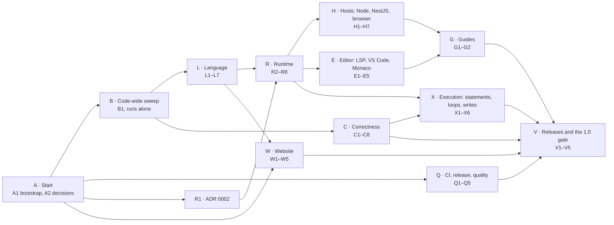

# Phases

The ordered list of every phase, with its Depends. **This table is the source of truth for the progress graph**: [`../tools/progress.mjs`](../tools/progress.mjs) reads the rows below (keep their format: `| [ID](ID.md) | Title | Kind | Size | Depends |`).

Rules for every phase: [`../README.md`](../README.md#rules-for-every-phase) · Decisions: [`../decisions.md`](../decisions.md) · Prompts: [`prompts.md`](prompts.md) · Progress (generated): [`../progress.md`](../progress.md)

A phase can start as soon as every phase in its Depends has `Status: done`. Phases in different lanes run at the same time. The generated progress page shows which phases are ready now and the earliest "wave" each phase can run in.

## Lanes

The picture shows lanes only. The exact order is the Depends column below.

- **A1 and A2 run first and at the same time.** A2 is the owner's decision sitting; it needs no code.
- **B1 runs alone.** It touches almost every source file (codes, formatting), so start no other *code* phase while it runs. Docs and design phases (R1, W1) and CI (Q1) may run next to it.
- **After B1 the lanes open wide**: L1 and C1 first (Q2 as soon as Q1 is done), then C2–C8, L2–L5, R2–R5, X1 and more.
- **The longest chain** runs through the runtime and hosts: R2 → R3 → R4 → R6/R8 → H4 → H5 → H6 → G1 → V2, with a second branch R4 → R7 → H1 → H2 → H3 → H6. Start those phases as soon as they are ready.
- **Priority when you have fewer sessions than ready phases** (decision [D02](../decisions.md#d02)): R and H first, then L3/L5/L6, C, E5, Q3, Q4; lane X and E2–E4 after them.

## Phase list

61 phases. Kinds: **Design**, **Mechanical**, **Mixed**, **Owner** (see [card format](../README.md#card-format)).

### A — Start

| ID | Phase | Kind | Size | Depends |
| --- | --- | --- | --- | --- |
| [A1](A1.md) | Plan bootstrap: AI entry file, rules, fragments and guards | Mechanical | S | — |
| [A2](A2.md) | Decision sitting | Owner | S | — |

### B — Code-wide sweep (runs alone)

| ID | Phase | Kind | Size | Depends |
| --- | --- | --- | --- | --- |
| [B1](B1.md) | Diagnostic codes, format and lint, one expected-result file per example | Mechanical | M | [A1](A1.md), [A2](A2.md) |

### Q — CI, release and quality

| ID | Phase | Kind | Size | Depends |
| --- | --- | --- | --- | --- |
| [Q1](Q1.md) | CI that catches real bugs | Mechanical | S | [A1](A1.md), [A2](A2.md) |
| [Q2](Q2.md) | Release automation and the `next` channel | Mechanical | M | [Q1](Q1.md) |
| [Q3](Q3.md) | Security hardening | Mixed | M | [R4](R4.md), [H2](H2.md) |
| [Q4](Q4.md) | Performance budgets | Mechanical | M | [R4](R4.md), [H5](H5.md) |
| [Q5](Q5.md) | Compatibility guard: language version and golden corpus | Mechanical | S | [R2](R2.md), [V1](V1.md) |

### L — Language

| ID | Phase | Kind | Size | Depends |
| --- | --- | --- | --- | --- |
| [L1](L1.md) | Call functions by name: remove `&` | Design → Mechanical | M | [B1](B1.md) |
| [L2](L2.md) | Spec examples under test | Mechanical | S | [L1](L1.md) |
| [L3](L3.md) | Names in any language, quoted names, physical names | Design → Mechanical | M | [L2](L2.md), [C1](C1.md) |
| [L4](L4.md) | Close the language backlog | Design → Mechanical | M | [L3](L3.md), [C5](C5.md) |
| [L5](L5.md) | Built-ins with several arguments: text, null and number functions | Design → Mechanical | M | [L1](L1.md), [C2](C2.md) |
| [L6](L6.md) | Date and time built-ins | Design → Mechanical | M | [L5](L5.md), [R3](R3.md) |
| [L7](L7.md) | `LOG` and the call statement | Design → Mechanical | M | [L4](L4.md), [L5](L5.md), [R7](R7.md), [R8](R8.md), [X3](X3.md) |

### C — Correctness: one language, two runtimes, one answer

| ID | Phase | Kind | Size | Depends |
| --- | --- | --- | --- | --- |
| [C1](C1.md) | Differential test harness | Mechanical | M | [B1](B1.md) |
| [C2](C2.md) | Exact `DECIMAL` numbers | Design → Mechanical | M | [C1](C1.md) |
| [C3](C3.md) | `CAST` runs in the interpreter | Design → Mechanical | M | [C2](C2.md) |
| [C4](C4.md) | Text `+`, division and `%` | Design → Mechanical | M | [C2](C2.md) |
| [C5](C5.md) | `CITEXT` and `LIKE` | Design → Mechanical | S | [C3](C3.md) |
| [C6](C6.md) | `check` accepts a top-level collection filter | Mechanical | M | [L1](L1.md) |
| [C7](C7.md) | `GROUPBY` on a related field | Mechanical | S | [C1](C1.md) |
| [C8](C8.md) | Checker completeness | Mixed | S | [L1](L1.md) |

### R — Runtime: one API, ports and adapters

| ID | Phase | Kind | Size | Depends |
| --- | --- | --- | --- | --- |
| [R1](R1.md) | ADR 0002: runtime ports and where programs run | Design | M | [A2](A2.md) |
| [R2](R2.md) | Runtime API core | Mechanical | M | [R1](R1.md), [L1](L1.md) |
| [R3](R3.md) | Ports: data, host functions and inputs, clock, events, write | Mechanical | M | [R2](R2.md) |
| [R4](R4.md) | Limits, cancellation and structured run errors | Mechanical | M | [R3](R3.md) |
| [R5](R5.md) | Program analysis: tiers and dependencies | Mechanical | M | [R2](R2.md) |
| [R6](R6.md) | Wire format v1 | Mechanical | S | [R4](R4.md), [R5](R5.md) |
| [R7](R7.md) | The CLI runs on the runtime API | Mechanical | M | [R4](R4.md) |
| [R8](R8.md) | The playground engine runs on the runtime API | Mechanical | M | [R4](R4.md), [R5](R5.md) |

### H — Hosts: Node, NestJS and the browser

| ID | Phase | Kind | Size | Depends |
| --- | --- | --- | --- | --- |
| [H1](H1.md) | Node adapters, transactions and the CommonJS build | Mechanical | M | [R7](R7.md) |
| [H2](H2.md) | NestJS module | Mechanical | M | [H1](H1.md), [R6](R6.md) |
| [H3](H3.md) | NestJS example app with end-to-end tests | Mechanical | M | [H2](H2.md) |
| [H4](H4.md) | Browser worker and two-way port bridge | Mechanical | M | [R6](R6.md), [R8](R8.md) |
| [H5](H5.md) | Remote runs, routing and the browser bundle | Mechanical | M | [H4](H4.md) |
| [H6](H6.md) | Browser example app with browser tests | Mechanical | M | [H5](H5.md), [H3](H3.md), [E5](E5.md) |
| [H7](H7.md) | The playground uses the published browser entry | Mechanical | S | [H5](H5.md), [E1](E1.md), [L7](L7.md) |

### E — Editor: language server, VS Code and Monaco

| ID | Phase | Kind | Size | Depends |
| --- | --- | --- | --- | --- |
| [E1](E1.md) | Editor services core | Mechanical | M | [R8](R8.md) |
| [E2](E2.md) | Language server: a schema per document, completion and hover | Mechanical | M | [E1](E1.md) |
| [E3](E3.md) | Language server extras | Mechanical | M | [E2](E2.md) |
| [E4](E4.md) | VS Code extension ready for the Marketplace | Mechanical | M | [E2](E2.md), [Q2](Q2.md) |
| [E5](E5.md) | Monaco integration for host apps | Mechanical | M | [E1](E1.md), [H4](H4.md), [L7](L7.md) |

### X — Execution: everything the grammar accepts runs

| ID | Phase | Kind | Size | Depends |
| --- | --- | --- | --- | --- |
| [X1](X1.md) | Queries accept `switch`, `if`, `is` and JSON literals | Mechanical | M | [C1](C1.md) |
| [X2](X2.md) | Multi-key `KEY` and user functions inside a query | Design → Mechanical | M | [X1](X1.md), [L4](L4.md) |
| [X3](X3.md) | Statements run: blocks, function bodies, assignment, `if!` | Mechanical | M | [R4](R4.md), [R8](R8.md) |
| [X4](X4.md) | Loops, `.$index` and tuples | Mechanical | M | [X3](X3.md) |
| [X5](X5.md) | Writes, part 1: the write port and table writes | Design → Mechanical | M | [X3](X3.md), [H1](H1.md), [H7](H7.md) |
| [X6](X6.md) | Writes, part 2: JSON arrays and path assignment | Mechanical | M | [X5](X5.md), [X4](X4.md) |

### G — Guides

| ID | Phase | Kind | Size | Depends |
| --- | --- | --- | --- | --- |
| [G1](G1.md) | Embedding guide, API reference and docs index | Mechanical | M | [H3](H3.md), [H6](H6.md), [E5](E5.md) |
| [G2](G2.md) | Shamsine integration guide | Mechanical | M | [R5](R5.md), [H3](H3.md), [H5](H5.md), [E5](E5.md), [L3](L3.md), [L6](L6.md) |

### W — Website (the playground)

| ID | Phase | Kind | Size | Depends |
| --- | --- | --- | --- | --- |
| [W1](W1.md) | Website design pass (Claude Design) | Design | M | [A2](A2.md) |
| [W2](W2.md) | Build the design: tokens, shell and workbench | Mechanical | M | [W1](W1.md), [L7](L7.md) |
| [W3](W3.md) | Build the design: landing, learn, examples, reference, embed | Mechanical | M | [W2](W2.md) |
| [W4](W4.md) | Deploy and verify the website | Mechanical | M | [W3](W3.md) |
| [W5](W5.md) | Launch kit and the TV demo | Owner | M | [W4](W4.md), [V2](V2.md) |

### V — Releases and the 1.0 gate

| ID | Phase | Kind | Size | Depends |
| --- | --- | --- | --- | --- |
| [V1](V1.md) | Release 0.2.0: the first public release | Owner | S | [L2](L2.md), [C3](C3.md), [C4](C4.md), [C5](C5.md), [C6](C6.md), [C7](C7.md), [C8](C8.md), [Q2](Q2.md) |
| [V2](V2.md) | Release 0.3.0: embeddable | Owner | S | [V1](V1.md), [L3](L3.md), [L5](L5.md), [L6](L6.md), [R5](R5.md), [H3](H3.md), [H6](H6.md), [H7](H7.md), [E5](E5.md), [G1](G1.md), [G2](G2.md), [Q3](Q3.md), [Q4](Q4.md), [Q5](Q5.md) |
| [V3](V3.md) | Release 0.4.0: the whole language runs | Owner | S | [V2](V2.md), [X2](X2.md), [X4](X4.md), [X6](X6.md), [L4](L4.md), [L7](L7.md), [E3](E3.md), [E4](E4.md) |
| [V4](V4.md) | Production readiness review | Mixed | M | [V3](V3.md), [W4](W4.md) |
| [V5](V5.md) | Release 1.0.0 | Owner | S | [V4](V4.md) |

## Release trains

A release contains **everything merged to `main`** when it is cut; the Depends of a release phase are only its minimum. Between releases, the `next` channel (Q2, decision [D05](../decisions.md#d05)) publishes a prerelease after every merge, so Shamsine can integrate early.

| Release | Theme | Minimum content |
|---|---|---|
| **0.2.0** (V1) | Correct, and published for the first time | `&` removed (L1), spec examples under test (L2), every wrong answer fixed (C1–C8), CI and release automation (Q1, Q2) |
| **0.3.0** (V2) | Embeddable, ready for Shamsine | Runtime API and ports (R2–R8), Node, NestJS and browser hosts (H1–H7), Monaco (E5), Unicode names (L3), built-ins and dates (L5, L6), guides (G1, G2), security, performance, compatibility (Q3–Q5) |
| **0.4.0** (V3) | The whole language runs | Statements, loops, writes (X3–X6), queries take every expression (X1, X2), the language backlog (L4), `LOG` (L7), the full language server and the Marketplace extension (E2–E4) |
| **1.0.0** (V5) | Production | The readiness review (V4) passes; the website is live (W4) |

## Shamsine cards M.0–M.16

Shamsine's forms plan (`shams-app/monorepo`, `docs/forms/phases/M.*.md`) has a Minab group. Cards M.1–M.3 were planned to run in this repo. This plan delivers them, and more:

| Shamsine card | What it needs from Minab | Delivered here by |
|---|---|---|
| M.0 Minab discovery | A written description of Minab's API, types and gaps | R1 (ADR 0002, with a Shamsine section) and G2 (the integration guide) |
| M.1 Library entry point | `import { check } from '@shamsine/minab'` in Vite and NestJS; diagnostics with ranges and codes | R2 (API, exports), B1 (codes), H1 (CommonJS for Nest and Jest), V2 (published) |
| M.2 Dependency analysis | Fields read, context variables, functions used, tier `local`/`data` | R5 |
| M.3 Evaluator with a pluggable data source | `run` with a data port, injected clock, limits, typed errors | R3, R4 (and C2 for exact money values) |
| M.4 Add Minab to Shamsine | A published version with a small browser chunk | V2 (or a `next` prerelease), H5 (bundle numbers) |
| M.5 Schema bridge | A recommended field type mapping | G2 |
| M.6 Validate expressions on save | `prepare` with an expected result type | R2 (`expect`) |
| M.7 Dynodb data source | A Node data port over a query function, per application | H1 |
| M.8 Evaluate API | A batch wire format, run by program id | R6, H2 |
| M.9 Local evaluation in the renderer | Browser worker runtime, dependency map for re-runs | H4, R5 |
| M.10 Remote evaluation | Remote client, batching, routing by tier | H5 |
| M.11–M.13 Expression editor | Monaco language, markers, completion, hover | E1, E5 |
| M.14–M.16 Designer and conditional behavior | Nothing new; performance numbers | Q4 |

G2 lists the changes the monorepo plan needs (for example: M.1–M.3 point here; `TODO.md` says the package is published, which was not true on 2026-10-01). The owner applies them in the monorepo; phases here never change it.

## Old phases 10–27 → new phases

[`../../release-future/phases-after-v0.2.0.md`](../../release-future/phases-after-v0.2.0.md) planned phases 10–27. Where each one went:

| Old | Old phase | New |
|---|---|---|
| 10 | Call functions by name: remove `&` | L1 |
| 11 | Publish 0.2.0 | V1 (with Q2's automation) |
| 12 | CI that can catch these bugs | Q1, Q2 |
| 13 | One language, two runtimes, one answer | C1–C5 |
| 14 | `check` tells the truth | C6, C7, C8 (no separate 0.2.1: it is in 0.2.0, decision D03) |
| 15 | Debugging: `LOG` | L7 (built on the event stream from R3) |
| 16 | Runtime architecture: ports and adapters | R1 |
| 17 | One runtime API | R2, R3, R4, R6, R7, R8 |
| 18 | The server host: Node and NestJS | H1, H2, H3 |
| 19 | The browser host | H4, H5, H6, H7, E5 |
| 20 | Package and document the runtime | R2 (exports), H1 (consumer tests), G1, V2 |
| 21 | The relational layer stops refusing ordinary expressions | X1, X2 |
| 22 | Statements run | X3, X4 |
| 23 | Writes | X5, X6 |
| 24 | Editor tooling worth using | E1, E2, E3, E4 |
| 25 | Playground: design, deploy, launch | W1–W5 |
| 26 | Close the language backlog | L2, L4, L5, L6 |
| 27 | 1.0 | V4, V5 |

**New in this plan** (not in the old one): A1 and A2 (how parallel AI sessions work; all decisions up front), B1 (codes for translation, lint, per-example files), L3 (Unicode and quoted names: Shamsine field names are free text), C2 (exact decimals: money), R5 (analysis: Shamsine's M.2), Q3 (security), Q4 (performance), Q5 (compatibility of stored programs), G2 (Shamsine guide), W5 (TV demo).

## Coverage map

Every item of [`../../release-future/remaining-after-v0.2.0.md`](../../release-future/remaining-after-v0.2.0.md) and where it lands.

| Inventory section | Item | Phase |
|---|---|---|
| 1 | Publish, tag, GitHub release, `.vsix`, manual VS Code check, CHANGELOG limitations | V1 (Q2 automates) |
| 2.1 | `CAST` does nothing in the interpreter | C3 |
| 2.1 | Text `+` | C4 |
| 2.1 | `switch` / `is` / JSON literal inside a query | X1 |
| 2.2 | Top-level collection filter does not check | C6 |
| 2.2 | `GROUPBY` on a traversed column | C7 |
| 2.2 | `CITEXT` vs. a string literal | C5 |
| 2.3 | Division and `%` | C4 |
| 2.3 | `LIKE` under `CITEXT`, escaping | C5 |
| 2.3 | `ORDERBY` on a non-alias | C8 |
| 3 | Loops, `.$index`, tuples | X4 |
| 3 | Blocks, function-body statements, local assignment, `if!` | X3 |
| 3 | `INSERT`/`UPDATE`/`DELETE`, path assignment, transactions, `--apply`, rules that write | X5, X6 |
| 3 | Multi-key `KEY`, user `fn` in a query | X2 |
| 3 | `FROM` over a filtered collection | X1 |
| 3 | Loop and recursion guards | R4 (limits), X3, X4 |
| 3 | Built-ins beyond the eight | L5, L6 |
| 3 | Non-Postgres dialects | D39, V4 |
| 4.1 | Three unregistered node types | C8 |
| 4.1 | `ref` = primary key shorthand; Phase 4 judgment calls into the spec | L4 |
| 4.1 | `TypeResult.origin` with two ranges | Post-1.0 list |
| 4.2 | §12 items 1–4, 8, 13, 17 | L4 |
| 4.3 | Spec examples under test, grammar block diff, `daysSincePayment` | L2 |
| 4.4 | Remove `&` | L1 |
| 5.1 | A schema per document, completion, hover, symbols, LSP test | E1, E2, E3 |
| 5.2 | Manual `.vsix` check | V1 |
| 5.2 | Extension CI, `.vsix` content guard | Q1 |
| 5.2 | Snippets, icon, settings, status bar, other editors | E4 |
| 6 | Design, brief items, deploy, Lighthouse, launch, versioning | W1–W5, D40–D42 |
| 6 | Playground follows the language | Inside each language card (L1, L3–L7, C6, X3–X6) |
| 7.1 | Postgres CI job, Node versions, release workflow, extension build, lint | Q1, Q2, B1 |
| 7.2 | Lockfiles, `.vsix` from a clean clone | Q1, Q2 |
| 7.3 | `status.md` rewrite, roadmap pointer | A1 |
| 7.3 | README and CHANGELOG limitations | V1–V3 |
| 7.3 | `.cursor/rules` upkeep | A1 (folder README rule) |
| 7.3 | Embedding guide, `exports`, docs index | R2, G1 |
| 9.1–9.2 | Runtime API, prepare once, host functions, clock, write port, cancellation, limits, structured errors, concurrency | R1–R4 |
| 9.3 | Browser: two-way bridge, no SQL from the browser, bundle budget | H4, H5, Q4 |
| 9.4 | NestJS: ESM/CommonJS, ORM adapters, transactions, schema as the security surface | H1, H2, H3, Q3 |
| 9.5 | `exports` map, optional peers, consumer smoke tests | R2, H1 |
| 10 | `LOG` and where logs go | L7 (R3 events, H2 Nest logger, H5 browser console) |

The old plan's notes for review, and where they went: Q1 → D01 · Q2 → D34, Q5 · Q3 → D39, G2 · Q4 → D45 · Q5 → G2 · Q6 → D37 · Q7 → D30 · N1–N4 → L7, D37 · N5 → Q4 and the post-1.0 list (batch runs) · N6 → Q5 · N7 → H5, Q4 · S1 → post-1.0 · S2 → D34, H2 · S3 → post-1.0 · S4 → post-1.0 · S5 → post-1.0 · S6 → D33 · S7 → post-1.0.

## After 1.0 (not in this plan)

Kept here so they are not lost. None of them blocks production.

- **Explain mode** for rules: show which sub-condition was false, with its values (old note S1; D45).
- **`minab schema pull`**: build the schema from Postgres foreign keys, Prisma or TypeORM (S3).
- **Edit vs. run split in the browser**: run a server-checked program without shipping the parser (S4).
- **Batch runs** `runMany(program, records)` compiled to one set-based statement (S5).
- **Step debugging** through the Debug Adapter Protocol (S7).
- **Structured data requests** instead of SQL (D28 option b), for offline data programs in the browser.
- **A second SQL dialect** (SQLite) (D39).
- **A code formatter** for Minab source.
- **`const`** bindings (§12 item 13, D24).
- **Diagnostics with two ranges** (`TypeResult.origin`, inventory 4.1).
- **Translations shipped by Minab** (D35 option b), a Persian website (D40).
- **Iterators and `yield`** (spec §12 item 9 history).
- **Step-by-step migration tooling** beyond the `migrate` framework (Q5), once a breaking change happens.
