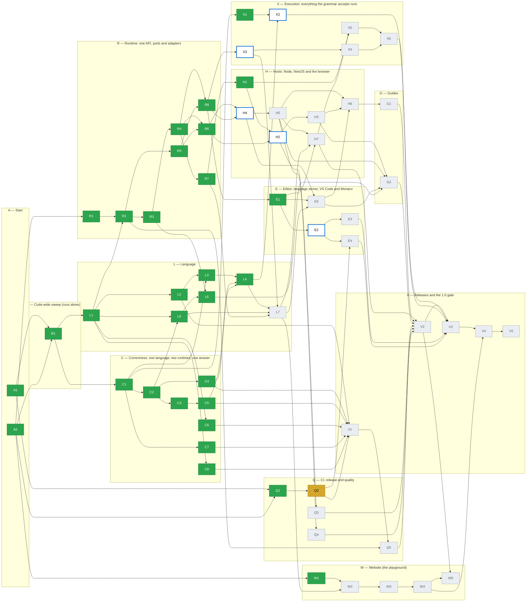

# Progress

**Generated by `node docs/production/tools/progress.mjs --write`. Do not edit by hand.** Phase branches never change this file; the `plan-progress.yml` workflow rebuilds it after each merge to `main`.

**30 of 61 done** · 1 waiting for approval · 0 blocked · 0 partial · **5 ready to start** · 25 not started · decisions answered: 45 of 45

Legend: 🟩 done · 🟨 waiting for approval · 🟥 blocked · 🟧 partial · ⬜ with a **bold blue outline**: ready to start (all Depends done) · ⬜ grey: not started. Arrows point from a phase to the phases that need it (arrows implied by other arrows are left out).

**Ready to start now (5):** [H2](phases/H2.md), [H4](phases/H4.md), [E2](phases/E2.md), [X2](phases/X2.md), [X3](phases/X3.md)

**Waiting for approval (1):** [Q2](phases/Q2.md)

**Blocked (0):** none

**Partial (0):** none

**Not started, waiting on Depends (25):** [Q3](phases/Q3.md), [Q4](phases/Q4.md), [Q5](phases/Q5.md), [L7](phases/L7.md), [H3](phases/H3.md), [H5](phases/H5.md), [H6](phases/H6.md), [H7](phases/H7.md), [E3](phases/E3.md), [E4](phases/E4.md), [E5](phases/E5.md), [X4](phases/X4.md), [X5](phases/X5.md), [X6](phases/X6.md), [G1](phases/G1.md), [G2](phases/G2.md), [W2](phases/W2.md), [W3](phases/W3.md), [W4](phases/W4.md), [W5](phases/W5.md), [V1](phases/V1.md), [V2](phases/V2.md), [V3](phases/V3.md), [V4](phases/V4.md), [V5](phases/V5.md)

**Done (30):** [A1](phases/A1.md), [A2](phases/A2.md), [B1](phases/B1.md), [Q1](phases/Q1.md), [L1](phases/L1.md), [L2](phases/L2.md), [L3](phases/L3.md), [L4](phases/L4.md), [L5](phases/L5.md), [L6](phases/L6.md), [C1](phases/C1.md), [C2](phases/C2.md), [C3](phases/C3.md), [C4](phases/C4.md), [C5](phases/C5.md), [C6](phases/C6.md), [C7](phases/C7.md), [C8](phases/C8.md), [R1](phases/R1.md), [R2](phases/R2.md), [R3](phases/R3.md), [R4](phases/R4.md), [R5](phases/R5.md), [R6](phases/R6.md), [R7](phases/R7.md), [R8](phases/R8.md), [H1](phases/H1.md), [E1](phases/E1.md), [X1](phases/X1.md), [W1](phases/W1.md)

**Open decisions (0):** none

## Waves

The earliest wave each phase can run in, if every phase took one step. Phases in the same wave can run at the same time. The number of waves is the length of the longest Depends chain.

| Wave | Phases |
| --- | --- |
| 1 | ~~A1~~, ~~A2~~ |
| 2 | ~~B1~~, ~~Q1~~, ~~R1~~, ~~W1~~ |
| 3 | Q2, ~~L1~~, ~~C1~~ |
| 4 | ~~L2~~, ~~C2~~, ~~C6~~, ~~C7~~, ~~C8~~, ~~R2~~, ~~X1~~ |
| 5 | ~~L3~~, ~~L5~~, ~~C3~~, ~~C4~~, ~~R3~~, ~~R5~~ |
| 6 | ~~L6~~, ~~C5~~, ~~R4~~ |
| 7 | ~~L4~~, ~~R6~~, ~~R7~~, ~~R8~~, V1 |
| 8 | Q5, ~~H1~~, H4, ~~E1~~, X2, X3 |
| 9 | L7, H2, H5, E2, X4 |
| 10 | Q3, Q4, H3, H7, E3, E4, E5, W2 |
| 11 | H6, X5, G2, W3 |
| 12 | X6, G1, W4 |
| 13 | V2 |
| 14 | W5, V3 |
| 15 | V4 |
| 16 | V5 |

## Questions for the owner

Collected from the "Questions for the owner" section of every status file.

- **A2:** Until Q1 merges, `CLAUDE.md` still says "do not commit bun or yarn lockfiles", which D07 now contradicts. A2 may not edit `CLAUDE.md`; Q1's card now changes that line. Recommendation: no action, Q1 fixes it.
- **A2:** `security@minab-lang.org` (D43) and the domain `minab-lang.org` (D40) must exist before Q3 and W4. Recommendation: register the domain and the mailbox before those phases start.
- **B1:** Some failures start in a node that the validator has no check for: a bare unknown name (`foo + 1`), an empty `if true { }` block, a one-column subquery with two columns used as a value, and `^` at the top level. They give no diagnostic in the editor today (the type checker knows them, the validator does not report them). B1 must not change behavior, so they are only tested at the type checker. Recommendation: let a language phase decide whether to report them (a new check for `NameRef`, `Block`, `Subquery`, `ParentRecord`).
- **Q1:** The `engines` change is breaking for Node 20 users, so `changes/Q1.md` has `breaking: true` (allowed before 1.0, D38). The README "Requires Node.js" line is still old. Recommendation: V1 updates it.
- **Q2:** Please run **Release** with `dry-run` on, from the Actions tab, after this PR is merged, and put the run link here. Recommendation: do it before V1. If it fails, ask for a fix in a small follow-up.
- **Q2:** npm trusted publishing must list `release.yml` **and** `next.yml` for `@shamsine/minab`. For the first publish the package may need to exist already (see `docs/releasing.md`). Please set this up and report the first `next.yml` run after merge.
- **Q2:** Create `VSCE_PAT` and `OVSX_PAT` before V1. E4 needs the Open VSX namespace.
- **L2:** The four example fixes above touch the spec and showcase. They follow the narrow governance exception, but please confirm them. Recommendation: accept.
- **C1:** Three gaps have no card that fixes them (see Later). Which card should take them? Recommendation: C4 for the null arithmetic, X1 for typed literal parameters, C8 or a small new decision for `IN` with null.
- **C2:** `formatValue` prints any top-level string that looks like a number (`"170"`) without quotes, because a decimal result is a string and the function cannot tell it from `TEXT`. A `TEXT` value `"170"` prints as `170` in the human output (not in `--json`). Recommendation: accept it for now; R6 (wire format) can add a type tag if it matters.
- **R2:** Size: the card is about 12 source files plus 6 tiny stubs and 4 READMEs. Hand-written logic is about 650 lines. Within budget.
- **R2:** (Answered) `expect` is optional: without it nothing is checked, for formula fields. It is also not checked for a query or an empty program, which have no `resultType`.
- **R3:** **Option names.** The card says `functions` and `inputs` at `createMinab`; ADR 0002 says `hostFunctions` and `hostInputs`. I followed the card. The run side keeps the ADR names (`RunPorts.hostFunctions`, `RunInputs.hostInputs`). Recommendation: keep it, and fix the ADR text when R6 or G1 touches it.
- **R3:** **Statement event and duration.** The card lists `durationMs` in the `statement` event, and also says it is emitted just before the data call. Both cannot hold. I kept the order (the playground's execution map relies on it) and moved the duration to a `timing` event after the call (`phase: 'data'`). Recommendation: keep it.
- **R3:** Size: about 14 hand-written source files and about 900 changed lines with the tests (card budget 12 files, 1,000 lines). Many of the files are small edits (types, codes, schema). Within twice the budget.
- **R4:** **Breaking change** (before 1.0, allowed by D38; the fragment says `breaking: true`). `run` returns `logs` and `stats`; `compile` returns `sql` where it returned `query`; a data port failure is now a result (`data.error`) and no longer a rejected promise. Recommendation: keep.
- **R4:** **Code names.** I used the names of the card (`limit.timeout`, `limit.tooManyRows`, …). ADR 0002 section 5 has other examples (`limit.time`, `limit.rows`). Recommendation: fix the ADR text when R6 or G1 touches it.
- **R4:** **A failed run has only `error`**, as the card says. The ADR also puts `logs` and `stats` on a failure. Recommendation: add them when L7 builds logs.
- **R4:** **Bracket scan before the parser.** The card says nesting is checked at `prepare`. The parser needs more than linear time and stack for deep programs: some shapes run out of stack at about 80 levels, and a 30,000-level source used over 8 GB before the walk of the tree could run. So `prepare` first scans the brackets in one pass (text in strings, quoted names and comments does not count) and refuses a source whose brackets nest deeper than `nestingDepth`. The walk over the expressions still runs after parsing. When the parser itself runs out of stack below the limit, `prepare` reports `limit.tooDeep` and `params.used` is a lower bound (`limit + 1`). Recommendation: keep.
- **R4:** **Size.** About 15 hand-written source and test files, and about 1,500 changed lines with the tests (budget 12 files and 1,000 lines). Within twice the budget, so I did not stop.
- **R5:** Size: 1 new source file (about 300 lines), 4 small source edits, 1 test file (about 250 lines). Within budget.
- **R6:** ADR 0002 section 9 still shows `programId` / `inputs.record` and `droppedLogs` / more stats fields. Recommendation: A2 or you update the ADR to the card's shape when H2 starts.
- **R7:** **`check --json` shape.** The diagnostics keep `severity` (a number), `range`, `message`, `code` and `data.params`. The Langium-only `data.code` (for example `"parsing-error"`) is gone, because the runtime diagnostic does not carry it, and the key order changed. Recommendation: keep.
- **R8:** **Wall time 10 s.** The playground never had a limit. I chose 10 s, so a first query on a slow machine does not time out. Recommendation: keep.
- **W1:** Share the canvas with any account that will run W2 or W3, if it is not your own. The canvas is private. Recommendation: W2 runs from your account, so no sharing is needed.

## Later

Collected from the "Later" section of every status file. This is the one list of deferred work; there is no shared TODO file.

- **A1:** The guard does not check `docs/production/tools/**`, `docs/production/status/README.md` or `docs/production/decisions.md` (owner or A2 only, but the card's table leaves them out; `decisions.md` may get one answer from any phase, which a file-level check cannot see). Add them if they are ever edited by mistake — owner.
- **A1:** The guard cannot see that a C/R/L/X phase changed only a checked output block of the root `README.md`; review covers that — owner.
- **A2:** npm trusted publishing from a private repository: if npm refuses it, Q2 falls back to `NPM_TOKEN` and tells the owner — Q2 checks it — Q2.
- **A2:** If the repository becomes public later: turn on provenance (Q2 already switches by itself), GitHub private vulnerability reporting (D43) and CodeQL (Q3) — owner decision — Q lane.
- **B1:** Report the failures that start in unregistered nodes (see Questions): `scope.unknownName`, `type.blockNoValue`, `query.singleColumnRequired`, `scope.noParentScope`, `scope.noStaticTable`, `scope.unknownTable` for a bare table, `type.cannotDetermine`, `type.notIterable` — they have codes but no editor diagnostic — next card, language lane.
- **B1:** Type-aware lint for `vscode-extension/src`: needs `moduleResolution` changed in `vscode-extension/tsconfig.json` (or a newer `oxlint-tsgolint`) — Q1 or E4.
- **B1:** Show the code in the human CLI output and in the playground UI — E3 (CLI), W2 (playground).
- **B1:** Run-time and compile-time error codes — R4.
- **B1:** Playground linter — W2.
- **B1:** `CLAUDE.md` still says "npm only" while D07 keeps `bun.lock`; Q1 changes that line — Q1.
- **Q1:** The playground has moderate `dompurify` advisories (via `monaco-editor`). The fix is a breaking `monaco-editor` upgrade; the audit job only fails on high — Q2
- **Q2:** Release notes in Persian — post-1.0, if ever wanted — none.
- **Q2:** Move the dry run of `release.yml` and the first `next.yml` run from "owner reports" to a checked result here — needs the merge first — owner.
- **L1:** Hover and go-to-definition on function names use the callee `NameRef` in the playground only for hover; full go-to-definition — E1, E2.
- **L2:** A filter on a to-many column at the top of a rule (`.orders[.status == "cancelled"]`, `COUNT(.orders[...]) < 5`, `loop order in .orders where ...`) does not type-check ("needs a statically known table"). Already logged in `docs/status.md`. 8 blocks are parse-only for this reason (`COLLECTION_FILTER_BUG` in the test). When it is fixed, remove them from the list — lane L4 or a checker fix.
- **L2:** 14 blocks (`.doctor...`, `.customers`, `INSERT`/`UPDATE`/`DELETE` on a relation) are parse-only: they need a record table with those relations. A second fixture (a `Clinic` table) would let the checker see them — lane L4.
- **L2:** Blocks with `...` placeholders and the ✗ notes are skipped, not rewritten. Spec prose is not touched here — lane L4.
- **L3:** TextMate grammar is generated and has no "name" rule. Unicode names show as plain text. A keyword written inside backticks (`.`FROM``) is still coloured as a keyword in VS Code (the playground tokenizer is correct) — needs a hand-made override of the generated grammar — lane E (editor).
- **L3:** `playground/src/engine/intel.ts` (completion) still uses ASCII word regexes (lines 205, 226, 289), so completion does not trigger on Persian names — file belongs to E1 — lane E.
- **L3:** `SELECT *` with a `sqlName` lists columns by hand; a foreign-key column that is not a schema column is left out of that list — rare; lane R.
- **L3:** VS Code `wordPattern` for Unicode names not set in `language-configuration.json` (its regex flavour is not checked) — lane E.
- **L3:** Playground table viewer finds tables by physical name; fine without `sqlName` — lane W.
- **L4:** **Langium bug with a keyword that is a lone backslash.** It writes the keyword unescaped into `ast.ts`, and the file does not compile. So `\` is a terminal (`INTEGER_DIVISION`), not a keyword; `BinaryExpression.operator` is typed `string` as a result. Spec §11 has a comment about it — nothing to do unless Langium fixes it.
- **L4:** **`\` in SQL has no safe-range check.** The interpreter fails with `eval.integerOutOfRange` for a result above 2^53; Postgres returns the exact `numeric`. Only reachable with huge operands — next null/number-rules work — none yet.
- **L4:** **A `null` operand of `\`** behaves like `/` and `%` (the interpreter fails, SQL gives `null`): the known gap from C4 — next null-rules work.
- **L4:** **`.customer.id == x` end-to-end differential case.** The harness inserts only the record's row, so a related row cannot exist. I tested the long form with real rows in `test/backlog.test.ts` instead. Related-row support for the harness — X1 or the next harness change.
- **L4:** `TypeResult.origin` with two ranges (post-1.0 list from the card) — post-1.0.
- **L4:** The `spec-examples` test no longer adds a block's prelude to a piece that starts with `let` (a second `let` with the same name is now an error, so the §9 `tags` example would collide). Test scaffolding only.
- **L5:** `GREATEST`/`LEAST` on text follow JavaScript string order, as `<` does. Postgres may order differently with a non-C collation — document or fix with the text ordering work — lane L.
- **L5:** A real-Postgres run of the L5 cases (`MINAB_TEST_DATABASE_URL`) — needs a throwaway database — lane Q.
- **L6:** Host panel fields for the time zone and a fixed "now" in the playground — the card allows it to move; it needs `src/host/config.ts` (a `clock` key), the workspace, the engine call, share links and a field in the Record tab — lane W.
- **L6:** A real-Postgres run of the L6 cases (`MINAB_TEST_DATABASE_URL`) — needs a throwaway database — lane Q.
- **L6:** `DATE` values given as `Date` objects are read as the UTC date. A driver that returns the local midnight (`pg` default) needs a type parser in the host's data port — lane R (embedding guide).
- **C1:** Literal-only expressions (`1 + 2`, `"a" + "b"`) fail in Postgres because the compiler binds literals untyped — wrong for hosts too, not only tests — none of C2–C8 names it — next card (or add typed parameters to C2/C4).
- **C1:** `x IN [1, 2]` on a `null` `x`: the interpreter says `false`, SQL says `null`. Spec §7.7 says `IN` is repeated `==`. Known gap `none yet` in `c1-known-gaps.cases.ts` — C4 or next card.
- **C1:** `x IN [1, null]` on a `null` `x`: interpreter `true`, SQL `null`. Same gap, same file — same card.
- **C1:** `null + 1`: the interpreter fails ("expected a number"), SQL answers `null`. Spec does not say. Known gap `none yet` — C4 (it owns operators) after an owner decision.
- **C1:** `is null` has no SQL form: known gap marked `X1` (the card that adds it).
- **C1:** Run the suites against a real Postgres (see Checks) — needs a server — Q1.
- **C2:** `INTEGER` literal-only expressions in SQL (`1 + 2`) still fail in Postgres (from C1) — typed parameters would fix it — X1 or next card.
- **C2:** A decimal in a list literal that is also used as a `JSON` value becomes a JSON number; `DECIMAL[]` stays exact — nothing to do unless the owner wants otherwise — none.
- **C2:** Rows that come from a pushed-down query keep the driver's text for `numeric` columns (for example `"8.30"`, not `"8.3"`). Scalar values are normalized, rows are not — R6 (wire format) — R6.
- **C3:** `JSON` to `TEXT` (and `JSON` objects to other types) in the interpreter, with Postgres's `jsonb` text format — needs a small design answer — next card or L4.
- **C3:** Cold-start test timeouts under parallel load (see Checks) — raise `testTimeout` in the vitest config — Q1.
- **C4:** `text + text` when both sides are `null` columns fails in the interpreter ("expected a number") while SQL gives `null`. The static type is not found for a bare expression with a record. Same family as the known gap "arithmetic with a null operand" (`.n + .a`) — next null-rules work — none yet.
- **C4:** `/` and `%` with a `null` operand fail in the interpreter and give `null` in SQL (same known gap, no card) — none yet.
- **C4:** A `%` literal-only case like `7 % 2` in SQL needs typed parameters (see C2 Later) — X1 or next card.
- **C5:** Case folding: the interpreter uses JS `toLowerCase()`, Postgres `citext` uses `lower()` of the database locale. They can differ for a few non-ASCII letters (already noted in the spec under §5.3.1) — can wait — L5 or Q1.
- **C5:** `ORDER BY` and `GROUP BY` on a `CITEXT` column in the interpreter — not in this card — X-lane.
- **C7:** `GROUPBY .customer.region` (a relation at the end of a multi-hop path) still uses the old subquery form — outside this card — X2 or a later correctness card
- **C7:** Using `.customer.country` directly in `SELECT` of a grouped query (without `KEY`) is not mapped to the joined column — outside this card — later correctness card
- **R1:** Test eviction of a service set while a run still uses it, and two schemas at once — the spike did not cover them — R2.
- **R1:** Split a core module without the `lsp` services, to shrink the browser bundle; measure the saving — R2, then H5 and Q4.
- **R1:** Repeat the CommonJS proof in a real `nest new` project (the spike used a hand-made Nest app) — H1.
- **R1:** Change the playground from a fixed document URI to one unique URI per prepare — R8.
- **R2:** `run` result and ports are today's shapes (`{ ok, value | error }`, `{ data: QueryExecutor }`) — R3 replaces them with the full ports and stats — R3.
- **R2:** `limits` is stored, not enforced — R4.
- **R2:** The CLI and the playground engine still build their own services and a fixed URI per channel — R7 and R8 move them to this API.
- **R2:** Optional warm-up of a new service set (ADR 0002, section 10) is not built — only useful for servers — H2.
- **R3:** A bare unknown name (for example `currentUser + 1` when nothing declares `currentUser`) gets no diagnostic from `prepare`; it fails only at run time with `unknown name`. This was already so before R3 (the type checker reports `scope.unknownName`, the validator does not report it for a bare name). A host input that the host forgot to declare is the likely case — lane C (correctness) or L1 follow-up.
- **R3:** A host name that is also a language keyword (`from`, `loop`) cannot be used in a program. `createMinab` does not refuse it yet — small check against the grammar's keywords — lane R, R4.
- **R3:** The runtime does not check the argument values and the result type of a host function (`eval.hostFunctionResult`, ADR 0002 4.3) — needs the structured errors of R4 — R4.
- **R3:** `EvalContext.onStatement` (with the AST node) stays for the playground's trace. Remove it when R8 moves the playground to `events` — R8.
- **R3:** `INSERT`, `UPDATE` and `DELETE` do not use the write port yet — X5.
- **R3:** The `local` flag of a host function is stored, not used — analysis tier (R5).
- **R4:** A bare host name that is a language keyword (`from`, `loop`) is not refused at `createMinab` — a small check against the grammar's keywords (from the R3 status) — lane R.
- **R4:** `eval.hostFunctionResult`: the runtime does not check the argument values or the result type of a host function (ADR 0002 4.3, from the R3 status) — lane R.
- **R4:** Finer codes: most interpreter failures are still `eval.failed` with `params.reason`, and most compiler refusals `compile.notSql`. Give the common ones their own code — lane R or B.
- **R4:** Parse time and memory grow faster than the size of a deeply nested source. The bracket scan caps the damage at the `nestingDepth` limit, but a program at the limit still costs the parser time. Measure it and set the budget — Q3 (performance).
- **R4:** `RunStats` has no `loopIterations`, `maxCallDepth` and `droppedLogs` (ADR 0002 section 5), and `logs` is always empty — X4 and L7.
- **R4:** The CLI and the playground still call `evaluate`, so they run with no limits until R7 and R8 move them to `PreparedProgram.run`. R7 and R8 must also remove `evaluate` and `EvalContext.onStatement` (see above) — R7, R8.
- **R4:** `22003` (numeric out of range) is only tested with a fake data port — a differential or database case would prove it on Postgres — lane C (correctness).
- **R5:** `inputs` lists names, not paths such as `currentUser.roles` (ADR section 7) — not needed by the card — Shamsine M.2 / R6.
- **R5:** Queries and DML are always `data`, even a query over a literal list — conservative on purpose — X phases may refine.
- **R6:** `droppedLogs` and the extra stats fields of the ADR (`loopIterations`, `maxCallDepth`) — `RunStats` has only `statements`, `rows`, `durationMs` today; the parser already accepts extra fields — add when L7 and R4 stats grow — lane R (H2).
- **R6:** A helper that builds a `WireResult` from a `RunResult` and the program's `resultType` — it belongs with the server — H2.
- **R7:** R4's compatibility adapter (`MinabInterpreter.evaluate`, `EvalContext.onStatement`) is still there. R8 has not merged, and the playground still calls it. Remove it in R8 — R8.
- **R7:** A run from the CLI now has the default limits (D36). There is no flag to change them — a CLI limits option — lane R, only if wanted.
- **R8:** Give the runtime the check-only constructs with ranges and the declared symbols, then drop the second parse and the second service set — lane R (with E1, which also moves `intel.ts`).
- **R8:** A `cancel` message for a running program (the runtime supports `signal`; the protocol has no cancel yet) — lane W or H4.
- **H1:** The `.d.ts` files import `langium`, which old `moduleResolution: node` cannot resolve. The TypeScript consumer needs `skipLibCheck: true` (the default of `nest new`). Hiding Langium types from the public `.d.ts` would fix it — owner to decide — Q-lane or R lane.
- **H1:** Each CommonJS bundle is self-contained, so a class such as `PortError` in `.` is not the same object as in `./node`. Hosts should match errors by `code`. Making `./node` share the runtime bundle would remove this — can wait — H2 lane.
- **E1:** Persian (L3) column hover is tested. Completion matches only ASCII words when it finds the partial word; a partly typed quoted name (after a backtick) gets no help — small — lane E (E2 or E5).
- **E1:** The prepared program does not keep its document, so the editor takes a parsed document, not a `PreparedProgram`. Keeping it there would let a host skip a second parse — small — lane R.
- **E1:** The `./editor` entry in the package `exports` is not added (R2 owns the map). Hosts outside this repo cannot import `src/editor/` until it exists — needs the owner or R2's lane.
- **X1:** `x is null` on a `JSON` column that holds the JSON value `null`: the interpreter says true, SQL says false (`jsonb 'null'` is not SQL null). The compiler has no column types, so it cannot tell — C5 or a typed-compiler card.
- **X1:** `is array` and the other kinds on a non-JSON column fail in Postgres (`jsonb_typeof` needs jsonb). The spec calls this meaningless, and `check` does not reject it — a checker rule — next card.
- **X1:** A bare literal as the operand of `is`/`CASE` subject (`"a" is string`) has an untyped parameter — typed literal parameters (see the C1 Later item) — C2 or next card.
- **X1:** Add a `docs/showcase.md` example for `FROM .orders[filter]` — prose, not needed for done — G1.
- **W1:** The landing name line: make its exact place and spacing final when W3 builds the landing page — round 2 approved it — W3.
- **W1:** A Persian font fallback (Vazirmatn or Noto Sans Arabic) after the mono stack, if the system fallback looks poor in the Persian example — only visible in the built app — W3.
- **W1:** Social handles for the launch posts: the owner has none yet — W5.
- **W1:** A Persian version of the site — after 1.0 (D40) — next card.
