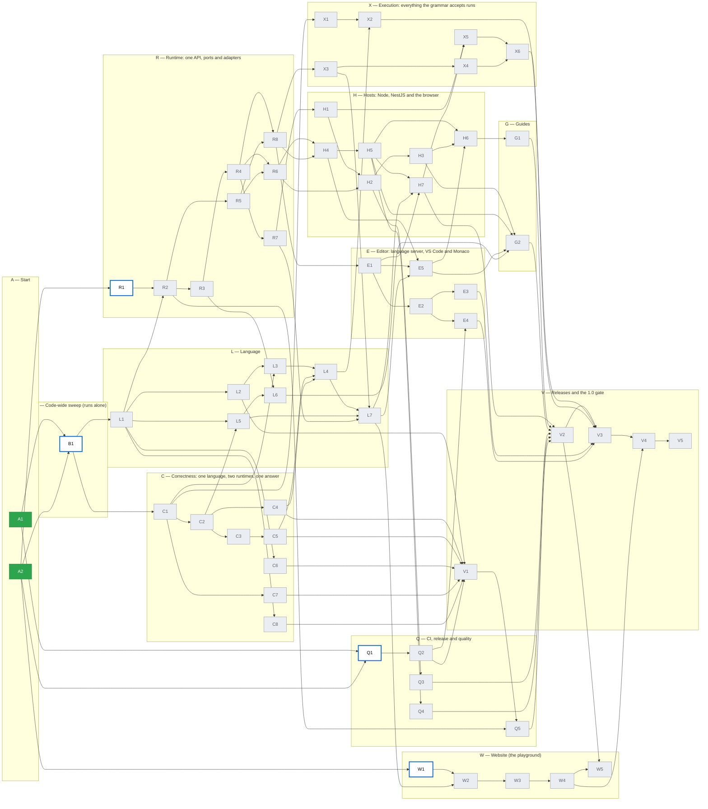

# Progress

**Generated by `node docs/production/tools/progress.mjs --write`. Do not edit by hand.** Phase branches never change this file; the `plan-progress.yml` workflow rebuilds it after each merge to `main`.

**2 of 61 done** · 0 waiting for approval · 0 blocked · 0 partial · **4 ready to start** · 55 not started · decisions answered: 45 of 45

Legend: 🟩 done · 🟨 waiting for approval · 🟥 blocked · 🟧 partial · ⬜ with a **bold blue outline**: ready to start (all Depends done) · ⬜ grey: not started. Arrows point from a phase to the phases that need it (arrows implied by other arrows are left out).

**Ready to start now (4):** [B1](phases/B1.md), [Q1](phases/Q1.md), [R1](phases/R1.md), [W1](phases/W1.md)

**Waiting for approval (0):** none

**Blocked (0):** none

**Partial (0):** none

**Not started, waiting on Depends (55):** [Q2](phases/Q2.md), [Q3](phases/Q3.md), [Q4](phases/Q4.md), [Q5](phases/Q5.md), [L1](phases/L1.md), [L2](phases/L2.md), [L3](phases/L3.md), [L4](phases/L4.md), [L5](phases/L5.md), [L6](phases/L6.md), [L7](phases/L7.md), [C1](phases/C1.md), [C2](phases/C2.md), [C3](phases/C3.md), [C4](phases/C4.md), [C5](phases/C5.md), [C6](phases/C6.md), [C7](phases/C7.md), [C8](phases/C8.md), [R2](phases/R2.md), [R3](phases/R3.md), [R4](phases/R4.md), [R5](phases/R5.md), [R6](phases/R6.md), [R7](phases/R7.md), [R8](phases/R8.md), [H1](phases/H1.md), [H2](phases/H2.md), [H3](phases/H3.md), [H4](phases/H4.md), [H5](phases/H5.md), [H6](phases/H6.md), [H7](phases/H7.md), [E1](phases/E1.md), [E2](phases/E2.md), [E3](phases/E3.md), [E4](phases/E4.md), [E5](phases/E5.md), [X1](phases/X1.md), [X2](phases/X2.md), [X3](phases/X3.md), [X4](phases/X4.md), [X5](phases/X5.md), [X6](phases/X6.md), [G1](phases/G1.md), [G2](phases/G2.md), [W2](phases/W2.md), [W3](phases/W3.md), [W4](phases/W4.md), [W5](phases/W5.md), [V1](phases/V1.md), [V2](phases/V2.md), [V3](phases/V3.md), [V4](phases/V4.md), [V5](phases/V5.md)

**Done (2):** [A1](phases/A1.md), [A2](phases/A2.md)

**Open decisions (0):** none

## Waves

The earliest wave each phase can run in, if every phase took one step. Phases in the same wave can run at the same time. The number of waves is the length of the longest Depends chain.

| Wave | Phases |
| --- | --- |
| 1 | ~~A1~~, ~~A2~~ |
| 2 | B1, Q1, R1, W1 |
| 3 | Q2, L1, C1 |
| 4 | L2, C2, C6, C7, C8, R2, X1 |
| 5 | L3, L5, C3, C4, R3, R5 |
| 6 | L6, C5, R4 |
| 7 | L4, R6, R7, R8, V1 |
| 8 | Q5, H1, H4, E1, X2, X3 |
| 9 | L7, H2, H5, E2, X4 |
| 10 | Q3, Q4, H3, H7, E3, E4, E5, W2 |
| 11 | H6, X5, G2, W3 |
| 12 | X6, G1, W4 |
| 13 | V2 |
| 14 | W5, V3 |
| 15 | V4 |
| 16 | V5 |

## Questions for the owner

Collected from the "Questions for the owner" section of every status file.

- **A2:** Until Q1 merges, `CLAUDE.md` still says "do not commit bun or yarn lockfiles", which D07 now contradicts. A2 may not edit `CLAUDE.md`; Q1's card now changes that line. Recommendation: no action, Q1 fixes it.
- **A2:** `security@minab-lang.org` (D43) and the domain `minab-lang.org` (D40) must exist before Q3 and W4. Recommendation: register the domain and the mailbox before those phases start.

## Later

Collected from the "Later" section of every status file. This is the one list of deferred work; there is no shared TODO file.

- **A1:** The guard does not check `docs/production/tools/**`, `docs/production/status/README.md` or `docs/production/decisions.md` (owner or A2 only, but the card's table leaves them out; `decisions.md` may get one answer from any phase, which a file-level check cannot see). Add them if they are ever edited by mistake — owner.
- **A1:** The guard cannot see that a C/R/L/X phase changed only a checked output block of the root `README.md`; review covers that — owner.
- **A2:** npm trusted publishing from a private repository: if npm refuses it, Q2 falls back to `NPM_TOKEN` and tells the owner — Q2 checks it — Q2.
- **A2:** If the repository becomes public later: turn on provenance (Q2 already switches by itself), GitHub private vulnerability reporting (D43) and CodeQL (Q3) — owner decision — Q lane.
