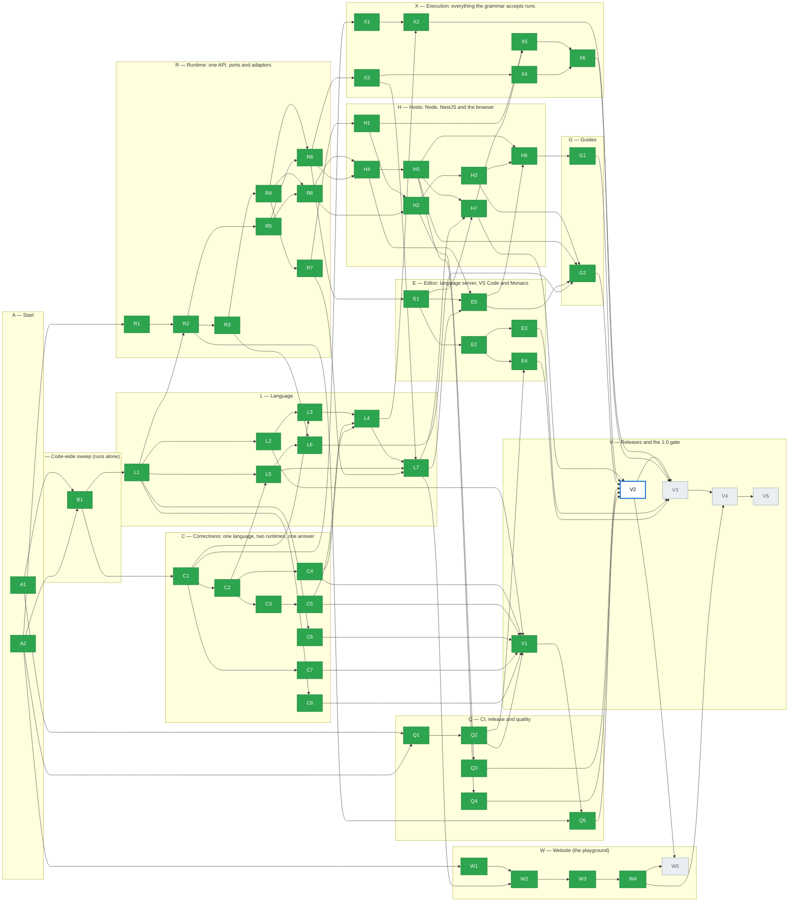

# Progress

**Generated by `node docs/production/tools/progress.mjs --write`. Do not edit by hand.** Phase branches never change this file; the `plan-progress.yml` workflow rebuilds it after each merge to `main`.

**56 of 61 done** · 0 waiting for approval · 0 blocked · 0 partial · **1 ready to start** · 4 not started · decisions answered: 45 of 45

Legend: 🟩 done · 🟨 waiting for approval · 🟥 blocked · 🟧 partial · ⬜ with a **bold blue outline**: ready to start (all Depends done) · ⬜ grey: not started. Arrows point from a phase to the phases that need it (arrows implied by other arrows are left out).

**Ready to start now (1):** [V2](phases/V2.md)

**Waiting for approval (0):** none

**Blocked (0):** none

**Partial (0):** none

**Not started, waiting on Depends (4):** [W5](phases/W5.md), [V3](phases/V3.md), [V4](phases/V4.md), [V5](phases/V5.md)

**Done (56):** [A1](phases/A1.md), [A2](phases/A2.md), [B1](phases/B1.md), [Q1](phases/Q1.md), [Q2](phases/Q2.md), [Q3](phases/Q3.md), [Q4](phases/Q4.md), [Q5](phases/Q5.md), [L1](phases/L1.md), [L2](phases/L2.md), [L3](phases/L3.md), [L4](phases/L4.md), [L5](phases/L5.md), [L6](phases/L6.md), [L7](phases/L7.md), [C1](phases/C1.md), [C2](phases/C2.md), [C3](phases/C3.md), [C4](phases/C4.md), [C5](phases/C5.md), [C6](phases/C6.md), [C7](phases/C7.md), [C8](phases/C8.md), [R1](phases/R1.md), [R2](phases/R2.md), [R3](phases/R3.md), [R4](phases/R4.md), [R5](phases/R5.md), [R6](phases/R6.md), [R7](phases/R7.md), [R8](phases/R8.md), [H1](phases/H1.md), [H2](phases/H2.md), [H3](phases/H3.md), [H4](phases/H4.md), [H5](phases/H5.md), [H6](phases/H6.md), [H7](phases/H7.md), [E1](phases/E1.md), [E2](phases/E2.md), [E3](phases/E3.md), [E4](phases/E4.md), [E5](phases/E5.md), [X1](phases/X1.md), [X2](phases/X2.md), [X3](phases/X3.md), [X4](phases/X4.md), [X5](phases/X5.md), [X6](phases/X6.md), [G1](phases/G1.md), [G2](phases/G2.md), [W1](phases/W1.md), [W2](phases/W2.md), [W3](phases/W3.md), [W4](phases/W4.md), [V1](phases/V1.md)

**Open decisions (0):** none

## Waves

The earliest wave each phase can run in, if every phase took one step. Phases in the same wave can run at the same time. The number of waves is the length of the longest Depends chain.

| Wave | Phases |
| --- | --- |
| 1 | ~~A1~~, ~~A2~~ |
| 2 | ~~B1~~, ~~Q1~~, ~~R1~~, ~~W1~~ |
| 3 | ~~Q2~~, ~~L1~~, ~~C1~~ |
| 4 | ~~L2~~, ~~C2~~, ~~C6~~, ~~C7~~, ~~C8~~, ~~R2~~, ~~X1~~ |
| 5 | ~~L3~~, ~~L5~~, ~~C3~~, ~~C4~~, ~~R3~~, ~~R5~~ |
| 6 | ~~L6~~, ~~C5~~, ~~R4~~ |
| 7 | ~~L4~~, ~~R6~~, ~~R7~~, ~~R8~~, ~~V1~~ |
| 8 | ~~Q5~~, ~~H1~~, ~~H4~~, ~~E1~~, ~~X2~~, ~~X3~~ |
| 9 | ~~L7~~, ~~H2~~, ~~H5~~, ~~E2~~, ~~X4~~ |
| 10 | ~~Q3~~, ~~Q4~~, ~~H3~~, ~~H7~~, ~~E3~~, ~~E4~~, ~~E5~~, ~~W2~~ |
| 11 | ~~H6~~, ~~X5~~, ~~G2~~, ~~W3~~ |
| 12 | ~~X6~~, ~~G1~~, ~~W4~~ |
| 13 | V2 |
| 14 | W5, V3 |
| 15 | V4 |
| 16 | V5 |

## Questions for the owner

Collected from the "Questions for the owner" section of every status file.

- **A2:** Until Q1 merges, `CLAUDE.md` still says "do not commit bun or yarn lockfiles", which D07 now contradicts. A2 may not edit `CLAUDE.md`; Q1's card now changes that line. Recommendation: no action, Q1 fixes it.
- **A2:** `security@minab-lang.org` (D43) and the domain `minab-lang.org` (D40) must exist before Q3 and W4. Recommendation: register the domain and the mailbox before those phases start.
- **B1:** Some failures start in a node that the validator has no check for: a bare unknown name (`foo + 1`), an empty `if true { }` block, a one-column subquery with two columns used as a value, and `^` at the top level. They give no diagnostic in the editor today (the type checker knows them, the validator does not report them). B1 must not change behavior, so they are only tested at the type checker. Recommendation: let a language phase decide whether to report them (a new check for `NameRef`, `Block`, `Subquery`, `ParentRecord`).
- **Q1:** The `engines` change is breaking for Node 20 users, so `changes/Q1.md` has `breaking: true` (allowed before 1.0, D38). The README "Requires Node.js" line is still old. Recommendation: V1 updates it.
- **Q3:** **Parse time of deep programs.** A program just under the nesting limit still costs the parser a lot: `ABS(` nested 100 times takes about 1 s to prepare, and 200 times about 3 s (it grows faster than linear). Prepare is not interruptible. Hosts should prepare stored programs when they are saved (written in `docs/security.md`). Recommendation: lower the default `nestingDepth` from 200 to about 64 (D36 says 200, so this is your call), or ask a lane R or Q4 card to find the slow rule in the parser.
- **Q3:** **Schema `version` is a security input.** `MinabModule` caches the runtime by `schemaLoader(...).version`. If a host gives two different schemas (two tenants) the same `version`, the second tenant gets the first one's schema. This is how H2 was designed, and `docs/security.md` says it. Recommendation: in a later H card, make the service refuse a schema whose content changed under the same version (hash the tables once per loader call), or key the cache by a hash.
- **Q4:** The completion row is at 45–48 ms against a 50 ms budget. CI fails it only above 75 ms, but it is tight. Recommendation: keep the budget, and look at it in a later phase if the editor feels slow.
- **Q4:** I gave the bundle row an allowance of 1 (fails above the budget itself), and the budget is H5's measured worker size (184,160 bytes) plus 10%. A size does not change between runs, so the 1.5 allowance would only hide growth. Say so if you want 1.5 there too.
- **L2:** The four example fixes above touch the spec and showcase. They follow the narrow governance exception, but please confirm them. Recommendation: accept.
- **C1:** Three gaps have no card that fixes them (see Later). Which card should take them? Recommendation: C4 for the null arithmetic, X1 for typed literal parameters, C8 or a small new decision for `IN` with null.
- **C2:** `formatValue` prints any top-level string that looks like a number (`"170"`) without quotes, because a decimal result is a string and the function cannot tell it from `TEXT`. A `TEXT` value `"170"` prints as `170` in the human output (not in `--json`). Recommendation: accept it for now; R6 (wire format) can add a type tag if it matters.
- **R2:** Size: the card is about 12 source files plus 6 tiny stubs and 4 READMEs. Hand-written logic is about 650 lines. Within budget.
- **R2:** (Answered) `expect` is optional: without it nothing is checked, for formula fields. It is also not checked for a query or an empty program, which have no `resultType`.
- **R3:** **Option names.** The card says `functions` and `inputs` at `createMinab`; ADR 0002 says `hostFunctions` and `hostInputs`. I followed the card. The run side keeps the ADR names (`RunPorts.hostFunctions`, `RunInputs.hostInputs`). Recommendation: keep it, and fix the ADR text when R6 or G1 touches it.
- **R3:** **Statement event and duration.** The card lists `durationMs` in the `statement` event, and also says it is emitted just before the data call. Both cannot hold. I kept the order (the playground's execution map relies on it) and moved the duration to a `timing` event after the call (`phase: 'data'`). Recommendation: keep it.
- **R3:** Size: about 14 hand-written source files and about 900 changed lines with the tests (card budget 12 files, 1,000 lines). Many of the files are small edits (types, codes, schema). Within twice the budget.
- **R4:** **Breaking change** (before 1.0, allowed by D38; the fragment says `breaking: true`). `run` returns `logs` and `stats`; `compile` returns `sql` where it returned `query`; a data port failure is now a result (`data.error`) and no longer a rejected promise. Recommendation: keep.
- **R4:** **Code names.** I used the names of the card (`limit.timeout`, `limit.tooManyRows`, …). ADR 0002 section 5 has other examples (`limit.time`, `limit.rows`). Recommendation: fix the ADR text when R6 or G1 touches it.
- **R4:** **A failed run has only `error`**, as the card says. The ADR also puts `logs` and `stats` on a failure. Recommendation: add them when L7 builds logs.
- **R4:** **Bracket scan before the parser.** The card says nesting is checked at `prepare`. The parser needs more than linear time and stack for deep programs: some shapes run out of stack at about 80 levels, and a 30,000-level source used over 8 GB before the walk of the tree could run. So `prepare` first scans the brackets in one pass (text in strings, quoted names and comments does not count) and refuses a source whose brackets nest deeper than `nestingDepth`. The walk over the expressions still runs after parsing. When the parser itself runs out of stack below the limit, `prepare` reports `limit.tooDeep` and `params.used` is a lower bound (`limit + 1`). Recommendation: keep.
- **R4:** **Size.** About 15 hand-written source and test files, and about 1,500 changed lines with the tests (budget 12 files and 1,000 lines). Within twice the budget, so I did not stop.
- **R5:** Size: 1 new source file (about 300 lines), 4 small source edits, 1 test file (about 250 lines). Within budget.
- **R6:** ADR 0002 section 9 still shows `programId` / `inputs.record` and `droppedLogs` / more stats fields. Recommendation: A2 or you update the ADR to the card's shape when H2 starts.
- **R7:** **`check --json` shape.** The diagnostics keep `severity` (a number), `range`, `message`, `code` and `data.params`. The Langium-only `data.code` (for example `"parsing-error"`) is gone, because the runtime diagnostic does not carry it, and the key order changed. Recommendation: keep.
- **R8:** **Wall time 10 s.** The playground never had a limit. I chose 10 s, so a first query on a slow machine does not time out. Recommendation: keep.
- **E4:** Allow `update.code.visualstudio.com` in the session network settings if you want me to run the smoke test here. Otherwise the CI job `smoke` is the check.
- **E4:** The bug contact is the security address, because D43 has no other contact. Do you want a separate support address?
- **X5:** Notes on how this differs from the card text (names and small details, adapted as the plan allows):
- **X5:** The card says `tx.execute(query, { signal }) → { rowCount }`. ADR 0002 section 4.2 and `src/runtime/ports.ts` (R3) had already fixed the port as `transaction(work, { signal })` and `tx.executeWrite(query, ctx) → { rows, affected }`, with `tx.execute` as the read port. I kept that shape, so no host contract changed.
- **X5:** Size: about 31 files and 1,430 changed lines (480 of them the new test file). That is under twice the line budget and over twice the file count, but 12 of the files are 1 to 5 line edits (exports, types, a tag, a list). All of "Done when" is in, so nothing was split.
- **X6:** A program that has a record context (`recordTable`) is a rule, and a rule cannot write (D26). So `.doctor.id = 21;` at the top level of such a program is `rule.writeInRule`; path assignment runs inside a loop over a table (`.` is the loop row) or from a loop variable. How should a host run a write command on one record (for example a Shamsine button on a customer)? Recommendation: let the host say a program is a command (a program kind that has a record and may write), in a small card of the runtime lane. Until then, a host can loop over `#Customer[.id == id]`.
- **X6:** Notes on how this differs from the card text (names and small details, adapted as the plan allows):
- **X6:** The card says the examples become runnable and the playground leaves the check-only list. Both were already done by X5 and X4, so X6 only verified them.
- **X6:** Size: about 12 logic and test files and 1,100 changed lines including the new test file (about 320 lines). This is under twice the line budget.
- **G2:** **System columns.** Is it true that `createdAt` is stored in `created_at` (the code of `createTable` says so, and the system fields are named `createdAt`)? Recommendation: check one real application database before M.5, and keep `sqlName` in `toMinabSchema` for the seven system fields.
- **G2:** **`id` type.** `dynodb.constants.ts` says `uuid`, `createTable` makes `INTEGER`. Recommendation: check a real database, then fix the constant or the guide.
- **G2:** **`timeTracking`, `numberRange`, `week`, `timeline`** are missing from the storage table in `packages/core/service/AGENTS.md`. Recommendation: Shamsine documents their shapes there, then a later Minab phase can add types for them.
- **G2:** **Minab gap: `JSON` has no key access.** `.location.lat` and `url.tab` (as `JSON`) cannot be read. Recommendation: Shamsine works with the guide's workaround now; a post-1.0 phase adds JSON path access (spec §5.6 says "once JSON path traversal exists").
- **G2:** **Minab gap: the schema types are not exported.** `scalarType`, `ColumnType`, `ScalarType` are not in the root entry, so a host builds the type object by hand. Recommendation: a small phase (or a part of V1) exports them.
- **G2:** **`languageVersion`** has no value or policy until Q5. The guide says to store the Minab package version meanwhile. Recommendation: keep it.
- **G2:** **Soft deletes.** I could not tell if Dynodb rows with `deleted_at` set are filtered. Recommendation: check the data service before M.7.
- **G2:** **Translations.** The fa, ar and tr text needs a native-speaker review (the `locales-translator` agent in the monorepo). Recommendation: review before it goes into `translations.json`.
- **W1:** Share the canvas with any account that will run W2 or W3, if it is not your own. The canvas is private. Recommendation: W2 runs from your account, so no sharing is needed.
- **W2:** The playground lint covers only the files this phase owns. Recommendation: let the next phase that edits `src/hooks`, `src/routes` or `src/engine` fix the 15 findings, then widen the `lint` script to all of `src`.
- **W2:** Please attach the screenshots to the pull request (see above).
- **W3:** Please attach the screenshots to the pull request (see above).
- **W3:** The gallery topic chips show "Names 1" in the design. That needs a new example tag in `content/`. Recommendation: add the tag in the next content phase.
- **W4:** Steps to do before the site goes live (recommendation: do them in this order):
- **W4:** 1. Cloudflare: add `minab-lang.org`, create the Pages project `minab` (Direct Upload).
- **W4:** 2. GitHub: add the secrets `CLOUDFLARE_API_TOKEN` and `CLOUDFLARE_ACCOUNT_ID`.
- **W4:** 3. Merge this pull request, or run **Deploy site** by hand (Actions tab). Then add the custom domain `minab-lang.org` to the Pages project.
- **W4:** 4. Tell a session to run the `curl -I` check and add the output here.
- **W4:** The PR preview URL comes from the run summary. If the deploy step fails with an authentication error, the token or the account ID is wrong.
- **V1:** **The stray tag `main`.** Remove it with `git push origin :refs/tags/main`. My recommendation: do it now, because `git checkout main` warns about an ambiguous name while the tag exists.

## Later

Collected from the "Later" section of every status file. This is the one list of deferred work; there is no shared TODO file.

- **A1:** The guard does not check `docs/production/tools/**`, `docs/production/status/README.md` or `docs/production/decisions.md` (owner or A2 only, but the card's table leaves them out; `decisions.md` may get one answer from any phase, which a file-level check cannot see). Add them if they are ever edited by mistake — owner.
- **A1:** The guard cannot see that a C/R/L/X phase changed only a checked output block of the root `README.md`; review covers that — owner.
- **A2:** npm trusted publishing from a private repository: if npm refuses it, Q2 falls back to `NPM_TOKEN` and tells the owner — Q2 checks it — Q2.
- **A2:** If the repository becomes public later: turn on provenance (Q2 already switches by itself), GitHub private vulnerability reporting (D43) and CodeQL (Q3) — owner decision — Q lane.
- **B1:** Report the failures that start in unregistered nodes (see Questions): `scope.unknownName`, `type.blockNoValue`, `query.singleColumnRequired`, `scope.noParentScope`, `scope.noStaticTable`, `scope.unknownTable` for a bare table, `type.cannotDetermine`, `type.notIterable` — they have codes but no editor diagnostic — next card, language lane.
- **B1:** Type-aware lint for `vscode-extension/src`: needs `moduleResolution` changed in `vscode-extension/tsconfig.json` (or a newer `oxlint-tsgolint`) — Q1 or E4.
- **B1:** Show the code in the human CLI output and in the playground UI — E3 (CLI), W2 (playground).
- **B1:** Run-time and compile-time error codes — R4.
- **B1:** Playground linter — W2.
- **B1:** `CLAUDE.md` still says "npm only" while D07 keeps `bun.lock`; Q1 changes that line — Q1.
- **Q1:** The playground has moderate `dompurify` advisories (via `monaco-editor`). The fix is a breaking `monaco-editor` upgrade; the audit job only fails on high — Q2
- **Q2:** Release notes in Persian — post-1.0, if ever wanted — none.
- **Q2:** Replace `OVSX_PAT` with an Open VSX trusted publisher, so there is no token to rotate — needs a change in `release.yml` and a check of how `ovsx` handles it — E4 or a Q lane card.
- **Q2:** `VSCE_PAT` and `OVSX_PAT` expire. Set a reminder to renew them — owner.
- **Q3:** CodeQL workflow (`.github/workflows/codeql.yml`) — the repository is private (D04), where CodeQL needs GitHub Advanced Security — write it if the repository becomes public — lane Q.
- **Q3:** Third-party security review before 1.0, if the owner wants one — note for V4.
- **Q3:** `LIKE` is O(text × pattern) in the worst case and cannot be interrupted by the wall time (it runs in one synchronous step). A pattern or a text that comes from data can be long. Cap text length in the host (written in `docs/security.md`), or add a budget check to the matcher — lane C or Q4.
- **Q3:** Widen the `run` fuzz generator (loops, `SWITCH`, user functions, host functions, DML with a write port) — lane Q.
- **Q3:** Parse time and memory of deeply nested programs (see Questions) — Q4.
- **Q4:** The first-ever `prepare` in a process builds the parser (about 95 ms). A host can call `prepare` once at startup. A `warmUp()` helper on the runtime would do it for them — lane R.
- **Q4:** The shared parser keeps the first service set alive (it holds that set's services). It is one set per process, so it is small — lane R if it ever matters.
- **Q4:** Completion parses the whole file on each call. Caching the parse by source hash would make it faster — lane E.
- **Q4:** The memory row measures the whole process (about 75 MB is Node and the loaded code). A row for Minab's own share needs a baseline — lane Q.
- **Q4:** Benchmarks against a real Postgres over the network — only useful once a host runs them (as on the card).
- **Q5:** The NestJS run endpoint (H2) and the wire format do not carry `languageVersion` yet. A stored program reads `{ source, languageVersion }` (D34). — it needs a wire change, which is not in this card — a Shamsine or wire follow-up.
- **Q5:** The corpus holds the spec and showcase blocks that check clean in one context. Blocks that are templates, need a prelude, or are wrong on purpose are left out. — it keeps the snapshot simple — a later quality pass.
- **Q5:** A `minab migrate` CLI command once the first real migration exists — no migration exists yet — post-1.0 list.
- **Q5:** Release phases V2, V3 and V5 must run `npm run compat:snapshot <version>`. — their cards already say so — V2, V3, V5.
- **L1:** Hover and go-to-definition on function names use the callee `NameRef` in the playground only for hover; full go-to-definition — E1, E2.
- **L2:** A filter on a to-many column at the top of a rule (`.orders[.status == "cancelled"]`, `COUNT(.orders[...]) < 5`, `loop order in .orders where ...`) does not type-check ("needs a statically known table"). Already logged in `docs/status.md`. 8 blocks are parse-only for this reason (`COLLECTION_FILTER_BUG` in the test). When it is fixed, remove them from the list — lane L4 or a checker fix.
- **L2:** 14 blocks (`.doctor...`, `.customers`, `INSERT`/`UPDATE`/`DELETE` on a relation) are parse-only: they need a record table with those relations. A second fixture (a `Clinic` table) would let the checker see them — lane L4.
- **L2:** Blocks with `...` placeholders and the ✗ notes are skipped, not rewritten. Spec prose is not touched here — lane L4.
- **L3:** TextMate grammar is generated and has no "name" rule. Unicode names show as plain text. A keyword written inside backticks (`.`FROM``) is still coloured as a keyword in VS Code (the playground tokenizer is correct) — needs a hand-made override of the generated grammar — lane E (editor).
- **L3:** `playground/src/engine/intel.ts` (completion) still uses ASCII word regexes (lines 205, 226, 289), so completion does not trigger on Persian names — file belongs to E1 — lane E.
- **L3:** `SELECT *` with a `sqlName` lists columns by hand; a foreign-key column that is not a schema column is left out of that list — rare; lane R.
- **L3:** VS Code `wordPattern` for Unicode names not set in `language-configuration.json` (its regex flavour is not checked) — lane E.
- **L3:** Playground table viewer finds tables by physical name; fine without `sqlName` — lane W.
- **L4:** **Langium bug with a keyword that is a lone backslash.** It writes the keyword unescaped into `ast.ts`, and the file does not compile. So `\` is a terminal (`INTEGER_DIVISION`), not a keyword; `BinaryExpression.operator` is typed `string` as a result. Spec §11 has a comment about it — nothing to do unless Langium fixes it.
- **L4:** **`\` in SQL has no safe-range check.** The interpreter fails with `eval.integerOutOfRange` for a result above 2^53; Postgres returns the exact `numeric`. Only reachable with huge operands — next null/number-rules work — none yet.
- **L4:** **A `null` operand of `\`** behaves like `/` and `%` (the interpreter fails, SQL gives `null`): the known gap from C4 — next null-rules work.
- **L4:** **`.customer.id == x` end-to-end differential case.** The harness inserts only the record's row, so a related row cannot exist. I tested the long form with real rows in `test/backlog.test.ts` instead. Related-row support for the harness — X1 or the next harness change.
- **L4:** `TypeResult.origin` with two ranges (post-1.0 list from the card) — post-1.0.
- **L4:** The `spec-examples` test no longer adds a block's prelude to a piece that starts with `let` (a second `let` with the same name is now an error, so the §9 `tags` example would collide). Test scaffolding only.
- **L5:** `GREATEST`/`LEAST` on text follow JavaScript string order, as `<` does. Postgres may order differently with a non-C collation — document or fix with the text ordering work — lane L.
- **L5:** A real-Postgres run of the L5 cases (`MINAB_TEST_DATABASE_URL`) — needs a throwaway database — lane Q.
- **L6:** Host panel fields for the time zone and a fixed "now" in the playground — the card allows it to move; it needs `src/host/config.ts` (a `clock` key), the workspace, the engine call, share links and a field in the Record tab — lane W.
- **L6:** A real-Postgres run of the L6 cases (`MINAB_TEST_DATABASE_URL`) — needs a throwaway database — lane Q.
- **L6:** `DATE` values given as `Date` objects are read as the UTC date. A driver that returns the local midnight (`pg` default) needs a type parser in the host's data port — lane R (embedding guide).
- **L7:** `logsTruncated` is not in the wire format yet (`logs` is) — a host over the wire cannot see it — a lane R card or H2.
- **L7:** The playground's click-to-select works; a better highlight style and the styling of the Console tab — W2.
- **L7:** Log lines use compact one-line JSON, not the table of `formatValue`: a table has many lines, and D37 wants one. A row list prints as JSON — no change needed unless the owner wants tables.
- **L7:** Loops are not executed yet (X4), so the 150-log test uses 150 statements. Add a loop test when X4 is done — X4.
- **C1:** Literal-only expressions (`1 + 2`, `"a" + "b"`) fail in Postgres because the compiler binds literals untyped — wrong for hosts too, not only tests — none of C2–C8 names it — next card (or add typed parameters to C2/C4).
- **C1:** `x IN [1, 2]` on a `null` `x`: the interpreter says `false`, SQL says `null`. Spec §7.7 says `IN` is repeated `==`. Known gap `none yet` in `c1-known-gaps.cases.ts` — C4 or next card.
- **C1:** `x IN [1, null]` on a `null` `x`: interpreter `true`, SQL `null`. Same gap, same file — same card.
- **C1:** `null + 1`: the interpreter fails ("expected a number"), SQL answers `null`. Spec does not say. Known gap `none yet` — C4 (it owns operators) after an owner decision.
- **C1:** `is null` has no SQL form: known gap marked `X1` (the card that adds it).
- **C1:** Run the suites against a real Postgres (see Checks) — needs a server — Q1.
- **C2:** `INTEGER` literal-only expressions in SQL (`1 + 2`) still fail in Postgres (from C1) — typed parameters would fix it — X1 or next card.
- **C2:** A decimal in a list literal that is also used as a `JSON` value becomes a JSON number; `DECIMAL[]` stays exact — nothing to do unless the owner wants otherwise — none.
- **C2:** Rows that come from a pushed-down query keep the driver's text for `numeric` columns (for example `"8.30"`, not `"8.3"`). Scalar values are normalized, rows are not — R6 (wire format) — R6.
- **C3:** `JSON` to `TEXT` (and `JSON` objects to other types) in the interpreter, with Postgres's `jsonb` text format — needs a small design answer — next card or L4.
- **C3:** Cold-start test timeouts under parallel load (see Checks) — raise `testTimeout` in the vitest config — Q1.
- **C4:** `text + text` when both sides are `null` columns fails in the interpreter ("expected a number") while SQL gives `null`. The static type is not found for a bare expression with a record. Same family as the known gap "arithmetic with a null operand" (`.n + .a`) — next null-rules work — none yet.
- **C4:** `/` and `%` with a `null` operand fail in the interpreter and give `null` in SQL (same known gap, no card) — none yet.
- **C4:** A `%` literal-only case like `7 % 2` in SQL needs typed parameters (see C2 Later) — X1 or next card.
- **C5:** Case folding: the interpreter uses JS `toLowerCase()`, Postgres `citext` uses `lower()` of the database locale. They can differ for a few non-ASCII letters (already noted in the spec under §5.3.1) — can wait — L5 or Q1.
- **C5:** `ORDER BY` and `GROUP BY` on a `CITEXT` column in the interpreter — not in this card — X-lane.
- **C7:** `GROUPBY .customer.region` (a relation at the end of a multi-hop path) still uses the old subquery form — outside this card — X2 or a later correctness card
- **C7:** Using `.customer.country` directly in `SELECT` of a grouped query (without `KEY`) is not mapped to the joined column — outside this card — later correctness card
- **R1:** Test eviction of a service set while a run still uses it, and two schemas at once — the spike did not cover them — R2.
- **R1:** Split a core module without the `lsp` services, to shrink the browser bundle; measure the saving — R2, then H5 and Q4.
- **R1:** Repeat the CommonJS proof in a real `nest new` project (the spike used a hand-made Nest app) — H1.
- **R1:** Change the playground from a fixed document URI to one unique URI per prepare — R8.
- **R2:** `run` result and ports are today's shapes (`{ ok, value | error }`, `{ data: QueryExecutor }`) — R3 replaces them with the full ports and stats — R3.
- **R2:** `limits` is stored, not enforced — R4.
- **R2:** The CLI and the playground engine still build their own services and a fixed URI per channel — R7 and R8 move them to this API.
- **R2:** Optional warm-up of a new service set (ADR 0002, section 10) is not built — only useful for servers — H2.
- **R3:** A bare unknown name (for example `currentUser + 1` when nothing declares `currentUser`) gets no diagnostic from `prepare`; it fails only at run time with `unknown name`. This was already so before R3 (the type checker reports `scope.unknownName`, the validator does not report it for a bare name). A host input that the host forgot to declare is the likely case — lane C (correctness) or L1 follow-up.
- **R3:** A host name that is also a language keyword (`from`, `loop`) cannot be used in a program. `createMinab` does not refuse it yet — small check against the grammar's keywords — lane R, R4.
- **R3:** The runtime does not check the argument values and the result type of a host function (`eval.hostFunctionResult`, ADR 0002 4.3) — needs the structured errors of R4 — R4.
- **R3:** `EvalContext.onStatement` (with the AST node) stays for the playground's trace. Remove it when R8 moves the playground to `events` — R8.
- **R3:** `INSERT`, `UPDATE` and `DELETE` do not use the write port yet — X5.
- **R3:** The `local` flag of a host function is stored, not used — analysis tier (R5).
- **R4:** A bare host name that is a language keyword (`from`, `loop`) is not refused at `createMinab` — a small check against the grammar's keywords (from the R3 status) — lane R.
- **R4:** `eval.hostFunctionResult`: the runtime does not check the argument values or the result type of a host function (ADR 0002 4.3, from the R3 status) — lane R.
- **R4:** Finer codes: most interpreter failures are still `eval.failed` with `params.reason`, and most compiler refusals `compile.notSql`. Give the common ones their own code — lane R or B.
- **R4:** Parse time and memory grow faster than the size of a deeply nested source. The bracket scan caps the damage at the `nestingDepth` limit, but a program at the limit still costs the parser time. Measure it and set the budget — Q3 (performance).
- **R4:** `RunStats` has no `loopIterations`, `maxCallDepth` and `droppedLogs` (ADR 0002 section 5), and `logs` is always empty — X4 and L7.
- **R4:** The CLI and the playground still call `evaluate`, so they run with no limits until R7 and R8 move them to `PreparedProgram.run`. R7 and R8 must also remove `evaluate` and `EvalContext.onStatement` (see above) — R7, R8.
- **R4:** `22003` (numeric out of range) is only tested with a fake data port — a differential or database case would prove it on Postgres — lane C (correctness).
- **R5:** `inputs` lists names, not paths such as `currentUser.roles` (ADR section 7) — not needed by the card — Shamsine M.2 / R6.
- **R5:** Queries and DML are always `data`, even a query over a literal list — conservative on purpose — X phases may refine.
- **R6:** `droppedLogs` and the extra stats fields of the ADR (`loopIterations`, `maxCallDepth`) — `RunStats` has only `statements`, `rows`, `durationMs` today; the parser already accepts extra fields — add when L7 and R4 stats grow — lane R (H2).
- **R6:** A helper that builds a `WireResult` from a `RunResult` and the program's `resultType` — it belongs with the server — H2.
- **R7:** R4's compatibility adapter (`MinabInterpreter.evaluate`, `EvalContext.onStatement`) is still there. R8 has not merged, and the playground still calls it. Remove it in R8 — R8.
- **R7:** A run from the CLI now has the default limits (D36). There is no flag to change them — a CLI limits option — lane R, only if wanted.
- **R8:** Give the runtime the check-only constructs with ranges and the declared symbols, then drop the second parse and the second service set — lane R (with E1, which also moves `intel.ts`).
- **R8:** A `cancel` message for a running program (the runtime supports `signal`; the protocol has no cancel yet) — lane W or H4.
- **H1:** The `.d.ts` files import `langium`, which old `moduleResolution: node` cannot resolve. The TypeScript consumer needs `skipLibCheck: true` (the default of `nest new`). Hiding Langium types from the public `.d.ts` would fix it — owner to decide — Q-lane or R lane.
- **H1:** Each CommonJS bundle is self-contained, so a class such as `PortError` in `.` is not the same object as in `./node`. Hosts should match errors by `code`. Making `./node` share the runtime bundle would remove this — can wait — H2 lane.
- **H2:** The endpoint does not cancel runs when the client closes the connection (`cancelled` / 499 exists, but nothing wires the socket to the run's `AbortSignal`) — it needs a platform-specific hook — H3 (example app) or a later H lane card.
- **H2:** The endpoint has no hook to release a per-request transaction after the batch — the host's `ports` function can open it, but cannot close it — H3 will show whether this is needed.
- **H2:** `StoredProgram.schemaVersion` (ADR 0002 section 4.6) is not used: the cache key uses the schema version from the loader — add it with Q5 (`languageVersion`).
- **H2:** The controller imports the value helpers (`decodeInputs`, `encodeBy`, `resultWireType`) from `src/browser/protocol.ts`. They have no browser code, but they would fit better in `src/runtime/` — a small move, with the worker — H5.
- **H2:** Documentation for Shamsine (module setup, guards, the production log default) — G1.
- **H3:** `MinabModule.forRootAsync` ignores `endpoint.guards` from the factory (a route is fixed before the factory runs), so a guard on the run endpoint must be an app-level guard (`APP_GUARD`). Either document it in G1 or take guards in `endpointPath` options — small fix in `src/nestjs/` — H lane (H2 follow-up)
- **H3:** The example has no guard on its endpoints, to stay short. The README says so — G1 can show `APP_GUARD` — G1
- **H3:** The run endpoint's data port uses the pool, not a per-request transaction, because the endpoint has no hook to close a transaction after the batch (H2 Later item). The example does not need it — later H lane card
- **H3:** No lockfile entry for Minab: `npm run setup` installs the tarball with `--no-save` — by design
- **H4:** Rows from the data port and query parameters have no known type, so `Big` and `Date` cross as strings. A typed data request could fix this — H5 or a later R card.
- **H4:** `createWorkerMinab` has no `cacheStats`. Add it if an app needs it — lane H.
- **H4:** A real-browser test of the worker file (`new Worker(new URL(...))`) — H6 (as the card says).
- **H4:** The playground moves onto this bridge — H7.
- **H5:** The wire format has no result type, so the client needs `resultType` (the router passes it) to decode `Big` and `Date`. A `resultType` in the answer would remove this — R6 follow-up or Q5.
- **H5:** The remote client has no retry or timeout of its own. The app can use `AbortSignal.timeout` — lane H.
- **H5:** The 780 kB worker is mostly the parser (Langium). Q4 decides if it needs a budget or a split.
- **H6:** Firefox and WebKit runs — only Chromium runs now — post-1.0, or W4 if cheap
- **H6:** `@playwright/test` is pinned to `~1.56.1` so it matches the Chromium that is installed in the cloud sandbox; CI downloads its own browser, so a newer version also works — update when convenient — Q-lane
- **H7:** Per-run worker ports (`ports` as a function of the run), column names in the data port result, and a run answer that carries host data, so the engine can execute programs through the bridge's `run` (the engine still runs them in its own runtime inside the worker) — a big change to the engine — next card
- **H7:** Drop the empty runtime that `createWorkerMinab` makes in the playground worker (`schema: { tables: [] }`); an option to create no runtime would do — small — lane H
- **E1:** Persian (L3) column hover is tested. Completion matches only ASCII words when it finds the partial word; a partly typed quoted name (after a backtick) gets no help — small — lane E (E2 or E5).
- **E1:** The prepared program does not keep its document, so the editor takes a parsed document, not a `PreparedProgram`. Keeping it there would let a host skip a second parse — small — lane R.
- **E1:** The `./editor` entry in the package `exports` is not added (R2 owns the map). Hosts outside this repo cannot import `src/editor/` until it exists — needs the owner or R2's lane.
- **E2:** Files that a config names (a separate schema file, a record file) are not watched, only `minab.config.json` — small — lane E.
- **E2:** Host functions and host inputs cannot be declared in `minab.config.json` yet, so the server uses none (they are not completed there) — needs a config format change — lane H or R.
- **E2:** Checks run at once on every change, with no delay. A delay may help on big files — small — lane E (E3).
- **E2:** `test/lsp.test.ts` is not changed: it still tests the Langium providers (`minab-hover-provider`, `minab-definition-provider`), which the new server no longer uses. They stay for hosts that use Langium directly — remove them in a cleanup — lane E.
- **E2:** The `vscode-languageserver-protocol` package is used by the test but is not a direct dependency (it comes with `vscode-languageserver`) — small — lane Q.
- **E3:** Checks run at once on every change, with no delay. A short delay may help on big files — small — lane E.
- **E3:** Rename works inside one document only. A `fn` that other documents call is not renamed there — needs a workspace model — post-1.0, lane E.
- **E3:** A `#alias` that is not found gets no "Did you mean" (`scope.unknownAlias`), and neither do unknown columns (`scope.unknownColumn`) — small — lane E.
- **E3:** Folding ranges and inlay hints for inferred types — post-1.0 unless cheap — lane E.
- **E3:** Codes in the CLI's human output behind a `--codes` flag — small — any later phase that already edits `src/cli/main.ts`.
- **E3:** Files that a config names are not watched; host functions and inputs cannot be declared in `minab.config.json` (from E2, still open) — lane H or R.
- **E3:** `test/lsp.test.ts` still tests the old Langium providers that the server no longer uses (from E2) — cleanup — lane E.
- **E3:** Parse-heavy tests time out at 5 s on a busy machine. A longer `testTimeout` in `vitest.config.ts` may help — small — lane Q.
- **E4:** The smoke test failed once at VS Code start (cold cache, "CodeWindow: detected unresponsive", run 37378175479). If it happens again, harden `test/runTest.ts` (for example `--disable-gpu`, or one retry of `runTests`). Do not skip the test — extension lane — if it repeats.
- **E4:** Manual check for V3: install the `.vsix`, open a `.minab` file, see the squiggle, the status bar item and the snippets; set `minab.configPath`; run the restart command. Record `images/screenshot.png` and add it to the README — owner — V3.
- **E4:** Run each launch line of `docs/editors.md` in a real Neovim, Helix and Zed — owner or a later session — V3.
- **E4:** `homepage` points to `minab-lang.org`, which may not be live yet (W4) — fix if it is still down at publish — V3.
- **E4:** A "Get Started" walkthrough — post-1.0 — E lane (card "Later").
- **E4:** Files that a config names (schema or record files) are still not watched — carried over from E2 — E lane.
- **E5:** The playground uses `./monaco` instead of its own `monaco/language.ts` — it keeps its setup until a cleanup — lane W or a cleanup after W3.
- **E5:** The worker keeps a second small service cache for the editor (4 sets), apart from the runtime's cache — saves a change to the runtime; share one cache if memory matters — lane H or Q4.
- **E5:** A mixed new main thread and old worker would wait for an `editor` answer that never comes — keep both from the same package version; a version check in `create` would fix it — lane H.
- **X1:** `x is null` on a `JSON` column that holds the JSON value `null`: the interpreter says true, SQL says false (`jsonb 'null'` is not SQL null). The compiler has no column types, so it cannot tell — C5 or a typed-compiler card.
- **X1:** `is array` and the other kinds on a non-JSON column fail in Postgres (`jsonb_typeof` needs jsonb). The spec calls this meaningless, and `check` does not reject it — a checker rule — next card.
- **X1:** A bare literal as the operand of `is`/`CASE` subject (`"a" is string`) has an untyped parameter — typed literal parameters (see the C1 Later item) — C2 or next card.
- **X1:** Add a `docs/showcase.md` example for `FROM .orders[filter]` — prose, not needed for done — G1.
- **X2:** A function with `let`s in its body could be inlined by substituting the lets (post-1.0, if users ask) — as in the card — post-1.0.
- **X2:** A function body that reads `.`, `^` or `#alias` is copied as is, so those names mean the query's row. `check` does not warn — a checker rule for function bodies — next card.
- **X2:** A bare `KEY` over several keys has no record value in `SELECT` — D22 says "record", but only `KEY.<name>` can be read. A JSON object of the keys would need a design answer — post-1.0.
- **X3:** Assignment into a path of a local value (`j.a = 1` where `j` is a `JSON` local) is refused with `eval.writesNotSupported`, the same as a record path — it is not a write to the database, so it could run — X4 or a later execution card.
- **X3:** Statements inside a `loop` body are not run — they come with X4 — X4.
- **X4:** Tests that said "loops are refused" (`test/statements.test.ts`, `test/evaluation.test.ts`, `test/cli.test.ts`) now use `DELETE` as the not-yet-run construct. This was on purpose, because loops run now.
- **X4:** Root `README.md` still says loops and `.$index` are not executed and marks `overdue-loop` check-only (lines 22, 141, 143, 145). It is a protected file for this card — G1 (docs)
- **X4:** A check-time error for `.$index` on a table collection (spec §3.5 calls it a semantic error). Today it is `eval.indexNeedsArray` at run time — a validator rule needs its own code — lane L / E
- **X4:** Differential cases for loops: the harness compares one expression, so a loop cannot be a case — C1 harness extension (not needed for X4)
- **X4:** Loop variable bound as `DECIMAL` bounds: `from`/`to`/`by` must be whole numbers, else a plain `eval.failed` error with no own code — lane L
- **X5:** Root `README.md`: the example table still marks `order-dml` and `reconcile-overdue-accounts` "check-only", and the CLI section does not mention `--apply`. The file is protected for this card — G1 (docs)
- **X5:** A value in `SET` or `VALUES` that the compiler cannot express (a call to a host function, a user function that is not inlinable) fails with `compile.notSql`. The interpreter could evaluate it and bind the result — lane X
- **X5:** In a dry run, a read after a write does not see the write (nothing ran). It is documented in the spec note, but a loop that depends on its own writes behaves differently in the two modes — lane X (document in the embedding guide, G2)
- **X5:** Parameter numbers in a write are not in text order (`SET … = $2 … WHERE … = $1`), because the target filter is compiled first. It is valid SQL; only the readability of the dry run suffers — lane X
- **X5:** `INSERT` into a table with a `ref` column cannot name the relation, only its foreign key column (`customer_id: …`) — next card (X6 or a later write card)
- **X5:** A `check-only` status in the playground gallery and cheat sheet has no entry left. The tag and the badge can go when X6 is done — W3 / X6
- **X5:** Writes to `JSON` arrays, ordinal targets and record path assignment — X6 (as the card says)
- **X6:** Field access inside a filter over a `JSON` array (`.tags[.k == "a"]`, `DELETE .tags WHERE .k == "a"`) does not check: the scope resolver has no table for the elements (`scope.columnNeedsTable`), for reads as well as writes. Position and `.$index` forms work — lane L (scope and types of JSON elements)
- **X6:** A relation step after a to-many step (`.patients[…].doctor.name = "x";`) is refused with `compile.writePath` — lane X (only if a host asks)
- **X6:** Assignment through a member of a local `JSON` variable (`let j: JSON = …; j.a = 1;`) is still refused with `eval.writesNotSupported` — lane X
- **X6:** Root `README.md`: the example table still marks `order-dml` and `reconcile-overdue-accounts` "check-only", and the CLI section does not mention `--apply` (same note as X5). Protected for this card — G1 (docs)
- **X6:** The check-only machinery in the playground (`CHECK_ONLY`, `explainRefusal`, the refusal callout) has no entry left and is dead code — W3
- **X6:** A dry run does not see its own writes in later reads (X5 note), except for `JSON` array columns, where the run remembers the new value — lane X (document in the embedding guide, G2)
- **G1:** Link `docs/security.md`, `docs/performance.md` and `docs/compatibility.md` from the guide and the index — they do not exist yet — Q3, Q4, Q5 (whoever merges last)
- **G1:** Publish `out/api/` — the website or the release does it — W4 or V2
- **G1:** The examples table in the root README still says `overdue-loop` is check-only and `discounted-total` is "called with `&`"; loops run since X4 and `&` is gone since L1 — protected file, left as is — owner or the next README edit
- **G1:** Require doc comments on properties too — about 150 plain fields — post-1.0
- **G1:** A hosted docs site — post-1.0, or the website later — W-lane
- **G2:** A Shamsine-specific helper `toMinabSchema(dataset)` — belongs in the monorepo (its M.5), not here — monorepo
- **G2:** Export `scalarType` and the schema column types from the package root — a small change in `src/runtime/index.ts` — lane R (any later runtime phase)
- **G2:** JSON key access in expressions — a language feature, needs a design — post-1.0 list
- **G2:** Range types (`numberRange`, `timeline`) — needs a language decision — post-1.0 list
- **G2:** Link the guide from `docs/guides/embedding.md` and the docs index — G1 is not merged yet, so the guides index does not exist — lane G (G1 or V3)
- **W1:** The landing name line: make its exact place and spacing final when W3 builds the landing page — round 2 approved it — W3.
- **W1:** A Persian font fallback (Vazirmatn or Noto Sans Arabic) after the mono stack, if the system fallback looks poor in the Persian example — only visible in the built app — W3.
- **W1:** Social handles for the launch posts: the owner has none yet — W5.
- **W1:** A Persian version of the site — after 1.0 (D40) — next card.
- **W2:** Fix the 15 lint findings (`no-floating-promises`, `no-misused-promises` and one `consistent-type-imports`) in `src/engine/worker.ts`, `src/hooks/useCommands.ts`, `src/routes/*`, `src/content/types.ts`, then widen the lint script to all of `src` — protected folders for this card — any phase that edits those folders, or Q1.
- **W2:** `src/hooks/useTheme.ts` asks only `prefers-color-scheme: dark`, so with an OS that states no preference it reports `light` while the CSS shows dark. Nothing reads `effective` today — the hooks folder was off limits — next time a phase edits hooks.
- **W2:** A light variant of the OG image (the handoff calls it optional) — nice to have — W3 or R-lane polish.
- **W2:** Landing, tour, gallery, reference and embed still use their old styles (they take the new tokens) — W3.
- **W2:** Drawer and palette are restyled; the cheat-sheet cards inside the drawer follow W3's reference page — W3.
- **W3:** Add the "Names" tag to `content/examples` and the name line to `content/landing.ts` — `content/` was off limits — next content phase.
- **W3:** The pushdown underline in the hero's Rule code and the landing diagram — the static `CodeBlock` has no span marks — W4 or a polish phase.
- **W3:** A light variant of the OG image (optional in the handoff) — nice to have — W4.
- **W3:** `og:image` uses a root path; set an absolute URL when the site address is known — W4 (deploy).
- **W3:** The embed view opens on the Execution tab when `tabs` is not set and no run has happened; check the intended first tab — W4.
- **W3:** Widen `npm run lint` to all of `src` (see W2) — any phase that edits hooks, engine or content.
- **W4:** Publish the API reference at `/api/` — `npm run docs:api` does not exist yet (G1 not done) — add one build step to `deploy-site.yml` when G1 is done (lane W, small).
- **W4:** Uptime monitoring — the card already moves it to W5 — W5.
- **W4:** The loading spinner keeps turning under reduced motion — it is a progress indicator, but a still version would be gentler — lane W (polish).
- **W4:** Landing performance has little margin (0.92–0.95 against 0.9). The next savings: split the 186 KB main bundle and drop unused JavaScript (Lighthouse estimates 777 KiB) — lane W (performance).
- **W4:** Dev-only `npm audit` findings in `@lhci/cli` — watch for a newer `@lhci/cli` — lane Q (maintenance).
- **V1:** `release.yml` must not run for real from a branch. A hand run with `dry-run` off creates a release and a tag named after the branch (`main`) and builds from the branch, not from a tag. Fix: stop the run unless the ref is a `v*` tag when `dry-run` is off — Q2 follow-up — lane Q (the owner decides if it becomes a card).
- **V1:** `npm` still has the placeholder as `latest` until the tag is pushed. After the release, `latest` is `0.2.0` — none.
- **V1:** Release notes are in English only — post-1.0, if wanted — none.
